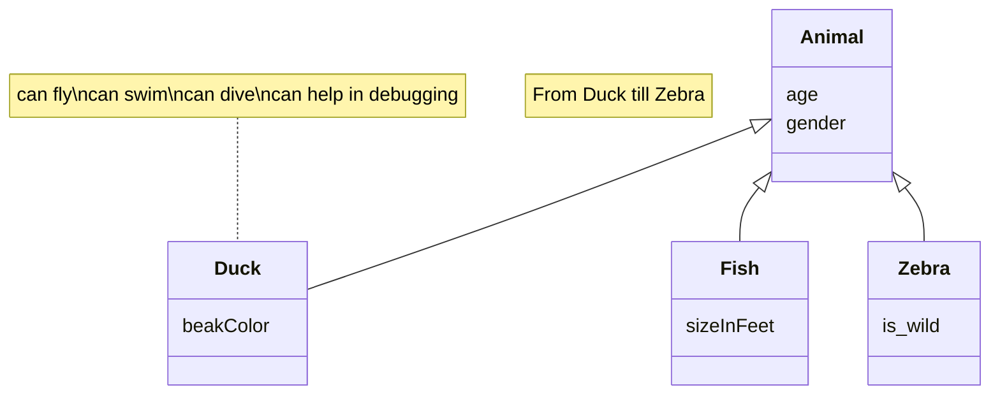

# Documento de análisis de requisitos del sistema

## Introducción

_En esta sección debes describir de manera general cual es la funcionalidad del proyecto a rasgos generales. ¿Qué valor puede aportar? ¿Qué objetivos pretendemos alcanzar con su implementación? ¿Cuántos jugadores pueden intervenir en una partida como máximo y como mínimo? ¿Cómo se desarrolla normalmente una partida?¿Cuánto suelen durar?¿Cuando termina la partida?¿Cuantos puntos gana cada jugador o cual es el criterio para elegir al vencedor?_

El proyecto se trata de la implementación web del juego End of Line. Su objetivo es ofrecer una versión accesible y entretenida del juego de mesa, permitiendo partidas en línea entre 1 y 8 jugadores. Durante las partidas los jugadores van colocando sus cartas formando un flujo sobre el tablero, con el objetivo de cortar el flujo del resto de jugadores (o de rellenar el tablero completo en el modo solitario).

La duración de las partidas varía según el número de jugadores, pero suele rondar los 3-10 minutos. La partida finaliza cuando un jugador logra que el resto no pueda continuar su flujo cuando llegue su turno.

[Enlace al vídeo de explicación de las reglas del juego / partida jugada por el grupo](https://www.youtube.com/watch?v=BimBk3iC7rs)

## Tipos de Usuarios / Roles

Administrador: Dueño o persona responsable que se encarga de mantener el sistema del juego y gestionar el uso de ese sistema.

Jugador: Persona o usuario que hace uso del sistema, con el fin de disfrutar del juego de mesa.

## Historias de Usuario

A continuación se definen  todas las historias de usuario a implementar:
_Os recomentamos usar la siguiente plantilla de contenidos que usa un formato tabular:_
 ### HU-(ISSUE#ID): Nombre ([Enlace a la Issue asociada a la historia de usuario]()
|Descripción de la historia siguiendo el esquema:  "Como <rol> quiero que el sistema <funcionalidad>  para poder <objetivo/beneficio>."| 
|-----|
|Mockups (prototipos en formato imagen de baja fidelidad) de la interfaz de usuario del sistema|
|Decripción de las interacciones concretas a realizar con la interfaz de usuario del sistema para lleva a cabo la historia. |

 ### HU-1: Lista de partidas en curso (https://github.com/gii-is-DP1/DP1-2024-2025--l4-02/issues/29)
|Como administrador quiero que el sistema liste las partidas en curso, incluyendo el creador y participantes de dicha partida, para poder llevar un seguimiento de las partidas que se están jugando.| 
|-----|
|Mockups (prototipos en formato imagen de baja fidelidad) de la interfaz de usuario del sistema|
|Decripción de las interacciones concretas a realizar con la interfaz de usuario del sistema para lleva a cabo la historia. |

 ### HU-2: Lista de partidas jugadas (https://github.com/gii-is-DP1/DP1-2024-2025--l4-02/issues/29)
|Como administrador quiero que el sistema liste todas las partidas jugadas y sus participantes, para poder tener un registro y control de las partidas jugadas del sistema.| 
|-----|
|Mockups (prototipos en formato imagen de baja fidelidad) de la interfaz de usuario del sistema|
|Decripción de las interacciones concretas a realizar con la interfaz de usuario del sistema para lleva a cabo la historia.|

 ### HU-3: Lista de partidas de cada jugador (https://github.com/gii-is-DP1/DP1-2024-2025--l4-02/issues/29)
|Como jugador quiero que el sistema liste mis partidas creadas y jugadas, para poder llevar un registro de mis partidas.| 
|-----|
|Mockups (prototipos en formato imagen de baja fidelidad) de la interfaz de usuario del sistema|
|Decripción de las interacciones concretas a realizar con la interfaz de usuario del sistema para lleva a cabo la historia. |

 ### HU-4: Autenticación y gestión de usuarios (https://github.com/gii-is-DP1/DP1-2024-2025--l4-02/issues/29)
|Como jugador, quiero poder registrarme (sign-up) añadiendo un nombre de usuario y una contraseña, así como iniciar sesión (login) y cerrar sesión (logout).| 
|-----|
|Mockups (prototipos en formato imagen de baja fidelidad) de la interfaz de usuario del sistema|
|Decripción de las interacciones concretas a realizar con la interfaz de usuario del sistema para lleva a cabo la historia. |

 ### HU-5: Edición de perfil (https://github.com/gii-is-DP1/DP1-2024-2025--l4-02/issues/32)
|Como jugador quiero editar mi perfil personal, cambiando mi foto de perfil y nombre de usuario.| 
|-----|
|Mockups (prototipos en formato imagen de baja fidelidad) de la interfaz de usuario del sistema|
|Decripción de las interacciones concretas a realizar con la interfaz de usuario del sistema para lleva a cabo la historia. |
  
### HU-6: Listado de usuarios (https://github.com/gii-is-DP1/DP1-2024-2025--l4-02/issues/30)
|Como administrador quiero poder acceder a un listado de usuarios paginado.| 
| ---- |
|Mockups (prototipos en formato imagen de baja fidelidad) de la interfaz de usuario del sistema|
|Decripción de las interacciones concretas a realizar con la interfaz de usuario del sistema para lleva a cabo la historia. |

 ### HU-7: CRUD usuarios (https://github.com/gii-is-DP1/DP1-2024-2025--l4-02/issues/30)
|Como administrador quiero poder realizar las operaciones básicas en la base de datos de usuarios con comprobación de seguridad y borrado en cascada de datos.| 
| ---- |
|Mockups (prototipos en formato imagen de baja fidelidad) de la interfaz de usuario del sistema|
|Decripción de las interacciones concretas a realizar con la interfaz de usuario del sistema para lleva a cabo la historia. |

 ### HU-8: Sistema de espectador (https://github.com/gii-is-DP1/DP1-2024-2025--l4-02/issues/32)
|Como jugador quiero que el sistema me permita unirme como espectador a una partida de mis amigos (todos los participantes deben ser mis amigos), para poder verlos jugar.| 
|-----|
|Mockups (prototipos en formato imagen de baja fidelidad) de la interfaz de usuario del sistema|
|Decripción de las interacciones concretas a realizar con la interfaz de usuario del sistema para lleva a cabo la historia. |

 ### HU-9: Sistema de invitación (https://github.com/gii-is-DP1/DP1-2024-2025--l4-02/issues/32)
|Como jugador quiero que el sistema me permita invitar a personas a una partida, para poder jugar o ver una partida con ellos.| 
|-----|
|Mockups (prototipos en formato imagen de baja fidelidad) de la interfaz de usuario del sistema|
|Decripción de las interacciones concretas a realizar con la interfaz de usuario del sistema para lleva a cabo la historia. |

 ### HU-10: Chat público durante partidas (https://github.com/gii-is-DP1/DP1-2024-2025--l4-02/issues/32)
|Como jugador quiero que el sistema tenga un chat durante la partida, para poder comunicarme con el resto de jugadores.| 
|-----|
|Mockups (prototipos en formato imagen de baja fidelidad) de la interfaz de usuario del sistema|
|Decripción de las interacciones concretas a realizar con la interfaz de usuario del sistema para lleva a cabo la historia. |

 ### HU-11: Sistema de amistad (https://github.com/gii-is-DP1/DP1-2024-2025--l4-02/issues/32)
|Como jugador quiero que el sistema me permita agregar y gestionar amigos, para poder ver si están en línea.| 
|-----|
|Mockups (prototipos en formato imagen de baja fidelidad) de la interfaz de usuario del sistema|
|Decripción de las interacciones concretas a realizar con la interfaz de usuario del sistema para lleva a cabo la historia. |

 ### HU-12: Datos relativos a partidas del jugador (https://github.com/gii-is-DP1/DP1-2024-2025--l4-02/issues/31)
|Como jugador quiero que el sistema me muestre el número de partidas que llevo jugadas, así como promedios de mis puntuaciones y máximo número de puntos, racha de victorias seguidas y media de victorias, para conocer mis datos de juego.| 
|-----|
|Mockups (prototipos en formato imagen de baja fidelidad) de la interfaz de usuario del sistema|
|Decripción de las interacciones concretas a realizar con la interfaz de usuario del sistema para lleva a cabo la historia. |

 ### HU-13: Datos globales de partidas (https://github.com/gii-is-DP1/DP1-2024-2025--l4-02/issues/31)
|Como jugador quiero poder ver datos globales de partidas como el número total de partidas, máximos puntos alcanzados y promedios de puntuaciones, para poder comparar esas estadísticas con las mías.| 
|-----|
|Mockups (prototipos en formato imagen de baja fidelidad) de la interfaz de usuario del sistema|
|Decripción de las interacciones concretas a realizar con la interfaz de usuario del sistema para lleva a cabo la historia. |

 ### HU-14: Datos de duración de partidas (https://github.com/gii-is-DP1/DP1-2024-2025--l4-02/issues/31)
|Como jugador quiero poder ver datos individuales y globales relativos a la duración de las partidas (partida más larga, más corta, cantidad total y promedia de tiempo de juego), para conocer más información sobre mis partidas.| 
|-----|
|Mockups (prototipos en formato imagen de baja fidelidad) de la interfaz de usuario del sistema|
|Decripción de las interacciones concretas a realizar con la interfaz de usuario del sistema para lleva a cabo la historia. |

 ### HU-15: Datos de número de jugadores (https://github.com/gii-is-DP1/DP1-2024-2025--l4-02/issues/31)
|Como jugador quiero que el sistema ofrezca estadísticas globales e individuales sobre el número de jugadores por partida medio, para saber qué modo de juego es el más jugado.| 
|-----|
|Mockups (prototipos en formato imagen de baja fidelidad) de la interfaz de usuario del sistema|
|Decripción de las interacciones concretas a realizar con la interfaz de usuario del sistema para lleva a cabo la historia. |

 ### HU-16: Estadísticas específicas de juego (https://github.com/gii-is-DP1/DP1-2024-2025--l4-02/issues/31)
|Como jugador quiero que el sistema me muestre estadísticas específicas de mis partidas (puntos en partidas individuales y poderes más utilizados), para conocer datos relativos a mi forma de jugar.| 
|-----|
|Mockups (prototipos en formato imagen de baja fidelidad) de la interfaz de usuario del sistema|
|Decripción de las interacciones concretas a realizar con la interfaz de usuario del sistema para lleva a cabo la historia. |

 ### HU-17: Ranking global (https://github.com/gii-is-DP1/DP1-2024-2025--l4-02/issues/31)
|Como jugador quiero que el sistema muestre un ranking de jugadores por partidas ganadas y por puntos en partidas individuales, para saber quiénes son los mejores jugadores.| 
|-----|
|Mockups (prototipos en formato imagen de baja fidelidad) de la interfaz de usuario del sistema|
|Decripción de las interacciones concretas a realizar con la interfaz de usuario del sistema para lleva a cabo la historia. |

 ### HU-18: Logros de usuario (https://github.com/gii-is-DP1/DP1-2024-2025--l4-02/issues/31)
|Como jugador quiero poder ver los logros que he conseguido, para tener una visión general de mis hazañas en el juego.| 
|-----|
|Mockups (prototipos en formato imagen de baja fidelidad) de la interfaz de usuario del sistema|
|Decripción de las interacciones concretas a realizar con la interfaz de usuario del sistema para lleva a cabo la historia. |
  

 ### HU-19: Logros de administrador (https://github.com/gii-is-DP1/DP1-2024-2025--l4-02/issues/31)
|Como administrador quiero poder crear y editar logros desde la interfaz.|
|-----|
|Mockups (prototipos en formato imagen de baja fidelidad) de la interfaz de usuario del sistema|
|Decripción de las interacciones concretas a realizar con la interfaz de usuario del sistema para lleva a cabo la historia. |

 ### HU-20: Seleccionar modo de juego (https://github.com/gii-is-DP1/DP1-2024-2025--l4-02/issues/29)
|Como jugador quiero seleccionar el modo de juego para configurar una nueva partida.| 
|-----|
|Mockups (prototipos en formato imagen de baja fidelidad) de la interfaz de usuario del sistema|
|Decripción de las interacciones concretas a realizar con la interfaz de usuario del sistema para lleva a cabo la historia. |

 ### HU-21: Crear partida (https://github.com/gii-is-DP1/DP1-2024-2025--l4-02/issues/29)
|Como jugador quiero poder crear partidas para jugar a los diferentes modos de juego.| 
|-----|
|Mockups (prototipos en formato imagen de baja fidelidad) de la interfaz de usuario del sistema|
|Decripción de las interacciones concretas a realizar con la interfaz de usuario del sistema para lleva a cabo la historia. |

## Diagrama conceptual del sistema
_En esta sección debe proporcionar un diagrama UML de clases que describa el modelo de datos a implementar en la aplicación. Este diagrama estará anotado con las restricciones simples (de formato/patrón, unicidad, obligatoriedad, o valores máximos y mínimos) de los datos a gestionar por la aplicación. _

_Recuerde que este es un diagrama conceptual, y por tanto no se incluyen los tipos de los atributos, ni clases específicas de librerías o frameworks, solamente los conceptos del dominio/juego que pretendemos implementar_
Ej:

_Si vuestro diagrama se vuelve demasiado complejo, siempre podéis crear varios diagramas para ilustrar todos los conceptos del dominio. Por ejemplo podríais crear un diagrama para cada uno de los módulos que quereis abordar. La única limitación es que hay que ser coherente entre unos diagramas y otros si nos referimos a las mismas clases_

_Puede usar la herramienta de modelado que desee para generar sus diagramas de clases. Para crear el diagrama anterior nosotros hemos usado un lenguaje textual y librería para la generación de diagramas llamada Mermaid_

_Si deseais usar esta herramienta para generar vuestro(s) diagramas con esta herramienta os proporcionamos un [enlace a la documentación oficial de la sintaxis de diagramas de clases de _ermaid](https://mermaid.js.org/syntax/classDiagram.html)_

## Reglas de Negocio
### R-< X > < Nombre Regla de negocio >
_< Descripción de la restricción a imponer >_

_Ej:_ 
### R1 – Diagnósticos imposibles
El diagnóstico debe estar asociado a una enfermedad que es compatible con el tipo de mascota de su visita relacionada. Por ejemplo, no podemos establecer como enfermedad diagnosticada una otitis cuando la visita está asociada a una mascota que es un pez, porque éstos no tienen orejas ni oídos (y por tanto no será uno de los tipos de mascota asociados a la enfermedad otitis en el vademecum).

…

_Muchas de las reglas del juego se transformarán en nuestro caso en reglas de negocio, por ejemplo, “la carta X solo podrá jugarse en la ronda Y si en la ronda anterior se jugó la carta Z”, o “en caso de que un jugador quede eliminado el turno cambia de sentido”_

