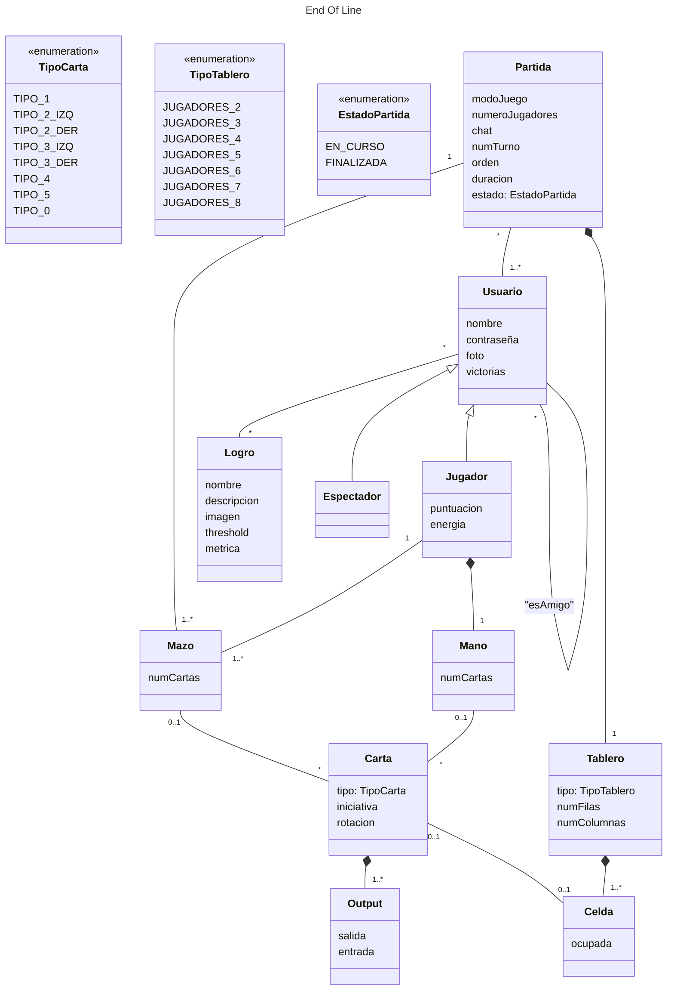

# Documento de análisis de requisitos del sistema

## Introducción

El proyecto se trata de la implementación web del juego End of Line. Su objetivo es ofrecer una versión accesible y entretenida del juego de mesa, permitiendo partidas en línea entre 1 y 8 jugadores. Durante las partidas los jugadores van colocando sus cartas formando un flujo sobre el tablero, con el objetivo de cortar el flujo del resto de jugadores (o de rellenar el tablero completo en el modo solitario).

La duración de las partidas varía según el número de jugadores, pero suele rondar los 3-10 minutos. La partida finaliza cuando un jugador logra que el resto no pueda continuar su flujo cuando llegue su turno.

[Enlace al vídeo de explicación de las reglas del juego / partida jugada por el grupo](https://www.youtube.com/watch?v=BimBk3iC7rs)

## Tipos de Usuarios / Roles

Administrador: Dueño o persona responsable que se encarga de mantener el sistema del juego y gestionar el uso de ese sistema.

Jugador: Persona o usuario que hace uso del sistema, con el fin de disfrutar del juego de mesa.

## Historias de Usuario

A continuación se definen  todas las historias de usuario a implementar:
_Os recomentamos usar la siguiente plantilla de contenidos que usa un formato tabular:_
 ### HU-(ISSUE#ID): Nombre ([Enlace a la Issue asociada a la historia de usuario]()
|Descripción de la historia siguiendo el esquema:  "Como <rol> quiero que el sistema <funcionalidad>  para poder <objetivo/beneficio>."| 
|-----|
|Mockups (prototipos en formato imagen de baja fidelidad) de la interfaz de usuario del sistema|
|Decripción de las interacciones concretas a realizar con la interfaz de usuario del sistema para lleva a cabo la historia. |

 ### HU-1: Lista de partidas en curso (https://github.com/gii-is-DP1/DP1-2024-2025--l4-02/issues/29)
|Como administrador quiero que el sistema liste las partidas en curso, incluyendo el creador y participantes de dicha partida, para poder llevar un seguimiento de las partidas que se están jugando.| 
|-----|
|Mockups (prototipos en formato imagen de baja fidelidad) de la interfaz de usuario del sistema|
|Decripción de las interacciones concretas a realizar con la interfaz de usuario del sistema para lleva a cabo la historia. |

 ### HU-2: Lista de partidas jugadas (https://github.com/gii-is-DP1/DP1-2024-2025--l4-02/issues/29)
|Como administrador quiero que el sistema liste todas las partidas jugadas y sus participantes, para poder tener un registro y control de las partidas jugadas del sistema.| 
|-----|
|Mockups (prototipos en formato imagen de baja fidelidad) de la interfaz de usuario del sistema|
|Decripción de las interacciones concretas a realizar con la interfaz de usuario del sistema para lleva a cabo la historia.|

 ### HU-3: Lista de partidas de cada jugador (https://github.com/gii-is-DP1/DP1-2024-2025--l4-02/issues/29)
|Como jugador quiero que el sistema liste mis partidas creadas y jugadas, para poder llevar un registro de mis partidas.| 
|-----|
|Mockups (prototipos en formato imagen de baja fidelidad) de la interfaz de usuario del sistema|
|Decripción de las interacciones concretas a realizar con la interfaz de usuario del sistema para lleva a cabo la historia. |

 ### HU-4: Autenticación y gestión de usuarios (https://github.com/gii-is-DP1/DP1-2024-2025--l4-02/issues/29)
|Como jugador, quiero poder registrarme (sign-up) añadiendo un nombre de usuario y una contraseña, así como iniciar sesión (login) y cerrar sesión (logout).| 
|-----|
|Mockups (prototipos en formato imagen de baja fidelidad) de la interfaz de usuario del sistema|
|Decripción de las interacciones concretas a realizar con la interfaz de usuario del sistema para lleva a cabo la historia. |

 ### HU-5: Edición de perfil (https://github.com/gii-is-DP1/DP1-2024-2025--l4-02/issues/32)
|Como jugador quiero editar mi perfil personal, cambiando mi foto de perfil y nombre de usuario.| 
|-----|
|Mockups (prototipos en formato imagen de baja fidelidad) de la interfaz de usuario del sistema|
|Decripción de las interacciones concretas a realizar con la interfaz de usuario del sistema para lleva a cabo la historia. |
  
### HU-6: Listado de usuarios (https://github.com/gii-is-DP1/DP1-2024-2025--l4-02/issues/30)
|Como administrador quiero poder acceder a un listado de usuarios paginado.| 
| ---- |
|Mockups (prototipos en formato imagen de baja fidelidad) de la interfaz de usuario del sistema|
|Decripción de las interacciones concretas a realizar con la interfaz de usuario del sistema para lleva a cabo la historia. |

 ### HU-7: CRUD usuarios (https://github.com/gii-is-DP1/DP1-2024-2025--l4-02/issues/30)
|Como administrador quiero poder realizar las operaciones básicas en la base de datos de usuarios con comprobación de seguridad y borrado en cascada de datos.| 
| ---- |
|Mockups (prototipos en formato imagen de baja fidelidad) de la interfaz de usuario del sistema|
|Decripción de las interacciones concretas a realizar con la interfaz de usuario del sistema para lleva a cabo la historia. |

 ### HU-8: Sistema de espectador (https://github.com/gii-is-DP1/DP1-2024-2025--l4-02/issues/32)
|Como jugador quiero que el sistema me permita unirme como espectador a una partida de mis amigos (todos los participantes deben ser mis amigos), para poder verlos jugar.| 
|-----|
|Mockups (prototipos en formato imagen de baja fidelidad) de la interfaz de usuario del sistema|
|Decripción de las interacciones concretas a realizar con la interfaz de usuario del sistema para lleva a cabo la historia. |

 ### HU-9: Sistema de invitación (https://github.com/gii-is-DP1/DP1-2024-2025--l4-02/issues/32)
|Como jugador quiero que el sistema me permita invitar a personas a una partida, para poder jugar o ver una partida con ellos.| 
|-----|
|Mockups (prototipos en formato imagen de baja fidelidad) de la interfaz de usuario del sistema|
|Decripción de las interacciones concretas a realizar con la interfaz de usuario del sistema para lleva a cabo la historia. |

 ### HU-10: Chat público durante partidas (https://github.com/gii-is-DP1/DP1-2024-2025--l4-02/issues/32)
|Como jugador quiero que el sistema tenga un chat durante la partida, para poder comunicarme con el resto de jugadores.| 
|-----|
|Mockups (prototipos en formato imagen de baja fidelidad) de la interfaz de usuario del sistema|
|Decripción de las interacciones concretas a realizar con la interfaz de usuario del sistema para lleva a cabo la historia. |

 ### HU-11: Sistema de amistad (https://github.com/gii-is-DP1/DP1-2024-2025--l4-02/issues/32)
|Como jugador quiero que el sistema me permita agregar y gestionar amigos, para poder ver si están en línea.| 
|-----|
|Mockups (prototipos en formato imagen de baja fidelidad) de la interfaz de usuario del sistema|
|Decripción de las interacciones concretas a realizar con la interfaz de usuario del sistema para lleva a cabo la historia. |

 ### HU-12: Datos relativos a partidas del jugador (https://github.com/gii-is-DP1/DP1-2024-2025--l4-02/issues/31)
|Como jugador quiero que el sistema me muestre el número de partidas que llevo jugadas, así como promedios de mis puntuaciones y máximo número de puntos, racha de victorias seguidas y media de victorias, para conocer mis datos de juego.| 
|-----|
|Mockups (prototipos en formato imagen de baja fidelidad) de la interfaz de usuario del sistema|
|Decripción de las interacciones concretas a realizar con la interfaz de usuario del sistema para lleva a cabo la historia. |

 ### HU-13: Datos globales de partidas (https://github.com/gii-is-DP1/DP1-2024-2025--l4-02/issues/31)
|Como jugador quiero poder ver datos globales de partidas como el número total de partidas, máximos puntos alcanzados y promedios de puntuaciones, para poder comparar esas estadísticas con las mías.| 
|-----|
|Mockups (prototipos en formato imagen de baja fidelidad) de la interfaz de usuario del sistema|
|Decripción de las interacciones concretas a realizar con la interfaz de usuario del sistema para lleva a cabo la historia. |

 ### HU-14: Datos de duración de partidas (https://github.com/gii-is-DP1/DP1-2024-2025--l4-02/issues/31)
|Como jugador quiero poder ver datos individuales y globales relativos a la duración de las partidas (partida más larga, más corta, cantidad total y promedia de tiempo de juego), para conocer más información sobre mis partidas.| 
|-----|
|Mockups (prototipos en formato imagen de baja fidelidad) de la interfaz de usuario del sistema|
|Decripción de las interacciones concretas a realizar con la interfaz de usuario del sistema para lleva a cabo la historia. |

 ### HU-15: Datos de número de jugadores (https://github.com/gii-is-DP1/DP1-2024-2025--l4-02/issues/31)
|Como jugador quiero que el sistema ofrezca estadísticas globales e individuales sobre el número de jugadores por partida medio, para saber qué modo de juego es el más jugado.| 
|-----|
|Mockups (prototipos en formato imagen de baja fidelidad) de la interfaz de usuario del sistema|
|Decripción de las interacciones concretas a realizar con la interfaz de usuario del sistema para lleva a cabo la historia. |

 ### HU-16: Estadísticas específicas de juego (https://github.com/gii-is-DP1/DP1-2024-2025--l4-02/issues/31)
|Como jugador quiero que el sistema me muestre estadísticas específicas de mis partidas (puntos en partidas individuales y poderes más utilizados), para conocer datos relativos a mi forma de jugar.| 
|-----|
|Mockups (prototipos en formato imagen de baja fidelidad) de la interfaz de usuario del sistema|
|Decripción de las interacciones concretas a realizar con la interfaz de usuario del sistema para lleva a cabo la historia. |

 ### HU-17: Ranking global (https://github.com/gii-is-DP1/DP1-2024-2025--l4-02/issues/31)
|Como jugador quiero que el sistema muestre un ranking de jugadores por partidas ganadas y por puntos en partidas individuales, para saber quiénes son los mejores jugadores.| 
|-----|
|Mockups (prototipos en formato imagen de baja fidelidad) de la interfaz de usuario del sistema|
|Decripción de las interacciones concretas a realizar con la interfaz de usuario del sistema para lleva a cabo la historia. |

 ### HU-18: Logros de usuario (https://github.com/gii-is-DP1/DP1-2024-2025--l4-02/issues/31)
|Como jugador quiero poder ver los logros que he conseguido, para tener una visión general de mis hazañas en el juego.| 
|-----|
|Mockups (prototipos en formato imagen de baja fidelidad) de la interfaz de usuario del sistema|
|Decripción de las interacciones concretas a realizar con la interfaz de usuario del sistema para lleva a cabo la historia. |

 ### HU-19: Logros de administrador (https://github.com/gii-is-DP1/DP1-2024-2025--l4-02/issues/31)
|Como administrador quiero poder crear y editar logros desde la interfaz.|
|-----|
|Mockups (prototipos en formato imagen de baja fidelidad) de la interfaz de usuario del sistema|
|Decripción de las interacciones concretas a realizar con la interfaz de usuario del sistema para lleva a cabo la historia. |

 ### HU-20: Seleccionar modo de juego (https://github.com/gii-is-DP1/DP1-2024-2025--l4-02/issues/29)
|Como jugador quiero seleccionar el modo de juego para configurar una nueva partida.| 
|-----|
|Mockups (prototipos en formato imagen de baja fidelidad) de la interfaz de usuario del sistema|
|Decripción de las interacciones concretas a realizar con la interfaz de usuario del sistema para lleva a cabo la historia. |

 ### HU-21: Crear partida (https://github.com/gii-is-DP1/DP1-2024-2025--l4-02/issues/29)
|Como jugador quiero poder crear partidas para jugar a los diferentes modos de juego.| 
|-----|
|Mockups (prototipos en formato imagen de baja fidelidad) de la interfaz de usuario del sistema|
|Decripción de las interacciones concretas a realizar con la interfaz de usuario del sistema para lleva a cabo la historia. |

## Diagrama conceptual del sistema

## Reglas de Negocio
### R-< X > < Nombre Regla de negocio >
_< Descripción de la restricción a imponer >_

_Muchas de las reglas del juego se transformarán en nuestro caso en reglas de negocio, por ejemplo, “la carta X solo podrá jugarse en la ronda Y si en la ronda anterior se jugó la carta Z”, o “en caso de que un jugador quede eliminado el turno cambia de sentido”_

### R1 - Cartas de Inicio
Cartas que dan comienzo a la línea del jugador en cada partida.

### R2 - Cartas de línea
Cartas que forman el recorrido de la línea de cada jugador en la partida. Se dividen en entrada, salidas e iniciativa.

### R3 - Cartas de energía
Cartas que representan la energía del jugador durante la partida. Empieza la partida con tres puntos de energía.

### R4 - Inicio de partida
Cada jugador comienza con cinco cartas en su mano salvo el modo de juego solitario clásico.

### R5 - Inicio de partida solitario clásico
El jugador comienza sin cartas en la mano.

### R7 - Cambio de mano inicial
Antes de comenzar la primera ronda, los jugadores tienen la posibilidad de cambiar su mano si no les convence, esto solo se puede hacer una vez.

### R8 - Flujo de línea
La entrada de las cartas que se coloquen debe ir unida a una de las salidas de la carta que se puso en la ronda anterior, excepto en la primera ronda, en la que la entrada de la primera carta que se coloque en el tablero debe ir unida a la salida de la carta de inicio.

### R9 - Emplazamiento de cartas
En la primera ronda cada jugador coloca una sola carta siguiendo el flujo de línea de la carta de inicio, en las rondas posteriores cada jugador debe colocar 2 cartas obligatoriamnete, salvo uso de poderes.

### R10 - Orden de turno
En la primera ronda se compara la iniciativa de la primera carta del mazo de cada jugador, el que tenga un menor número de iniciativa comenzará el juego y el resto de jugadores seguirán un sentido horario, en caso de empate se repetirá el proceso hasta resolverlo. En las rondas siguientes se usa la misma lógica, pero se comparan las iniciativas de la última carta colocada por cada juagdor, si hubiera empate se miran las cartas que se pusieron en la ronda anterior, si se llega a la carta de inicio el orden es igual al de la primera ronda de juego.

### R11 - Ejecución de rondas
Cada ronda comienza con el orden de juego establecido, cada jugador pondrá sus cartas de línea correspondientes. La ronda termina cuando cada jugador ha colocado sus cartas en el tablero y se ha ejecutado la fase de robo salvo en el solitario clásico.

### R12 - Fase de robo
Tras colocar las cartas de línea en el tablero cada jugador deberá robas cartas de su mazo hasta volver a tener 5 en la mano salvo el modo de juego solitario clásico.

### R13 - Ronda solitario clásico
En cada ronda el jugador va robando las cartas de su mazo de una en una decidiendo si colocarla en el tablero continuando su línea o descartarla boca arriba en una pila de descarte. Solo colocará una carta en el tablero por ronda y tendrá la opción de colocar posteriormente la carta de la parte superior de la pila de descarte en el tablero.

### R14 - Pila de descarte
Corresponde al modo solitario clásico. Es una pila de cartas en la que el jugador podrá descartar las cartas no interesadas para la ronda. 

### R15 - Salto de línea
Habilidad que permite saltar la línea de tu compañero en un turno consumiendo un punto de energía, en ningún momento podras continuar la línea de tu compañero. Corresponde al modo de juego Team Battle.

### R16 - Uso de poderes
No se podrá usar ninguno de los poderes hasta la cuarta ronda. Solo se puede usar los poderes en tu turno.

### R17 - Gasto de energía
Cada vez que un jugador utilice un poder perderá un punto de energía, solo se puede gastar un punto por ronda. Cada jugador cuenta con tres puntos de energía por partida.

### R18 - Poder Acelerón
Permite colocar tres cartas de línea en vez de dos.

### R19 - Poder Frenazo
Permite colocar una sola carta de línea en vez de dos.

### R20 - Poder Marcha Atrás
Permite continuar tu línea en tu penúltima carta de línea colocada en vez de la última.

### R21 - Poder Gas Extra
Permite robar una carta de línea adicional.

### R22 - Tamaño de los mazos
Cada jugador dispone de un mazo cuyo tamaño viene dado por: 50/número de jugadores. Independientemente del número de jugadores en la partida, cada uno de ellos deberá tener una mano de 5 cartas, salvo uso de poderes.

### R23 - Condición de derrota
Si en una ronda uno de los jugadores no puede colocar alguna de las 2 cartas, quedará eliminado.

### R24 - Límite de jugadores por partida
Cada partida debe tener entre 1 y 8 jugadores, dependiendo del modo de juego. El modo versus o battle royale cuenta con un mínimo de 2 jugadores y con un máximo de 8 al igual que el puzle cooperativo. El puzle solitario y solitaro clásico cuentan con un solo jugador. El team battle cuenta con un mínimo de cuatro jugadores y un máximo de ocho. 

### R25 - Área de juego
Las áreas de juego dependen del modo de juego que se eliga y el número de jugadores de ese modo. En el modo versus o battle royale el área de juego para dos y tres personas es de 7x7, para cuatro y cinco personas de 9x9, para seis y siete personas de 11x11 y para ocho personas de 13x13. En el modo puzzle solitario el área de juego es 5x5 mientras que en el cooperativo el área es la misma al de modo versus según los participantes. Por último el team battle tiene la misma área de juego que el modo battle royale ya que también depende de los jugadores. 

### R26 - Limites laterales
El área de juego está limitada por una cuadrícula cuyos bordes están conectados ortogonalmente (Arriba-Abajo; Izquierda-Derecha)

### R27 - Victoria puzle solitario y solitario clásico
El objetivo es cubrir la totalidad del área de juego de 5x5.

### R28 - Victoria cooperativo
El objetivo es cubrir la totalidad del área de juego que dependerá del número de jugadores.

### R29 - Restricciones de espectador
Todos los participantes de una partida deben ser amigos de un usuario para que este pueda unirse a esa partida como espectador.

