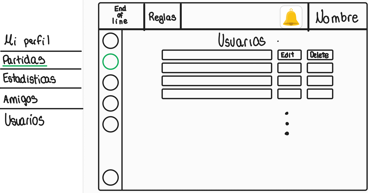

# Documento de análisis de requisitos del sistema

## Introducción

Este proyecto trata de la implementación web del juego End of Line, con el objetivo de ofrecer una versión accesible y entretenida del juego de mesa. End of Line es un juego de estrategia por turnos de 1 a 8 jugadores en el que la duración de las partidas varía según el número de jugadores y el modo de juego, pero suelen rondar los 5-15 minutos. El objetivo es simple, cortar la línea del rival antes de que él corte la tuya. 

En una partida cada jugador empieza con un mazo cuyo tamaño depende del número de jugadores que haya en la partida, y una mano en la que normalmente habrá 5 cartas. En la primera ronda cada jugador coloca una sola carta en su turno, en todas las rondas posteriores cada jugador está obligado a colocar dos cartas que continúen el flujo desde la última carta que colocaron (salvo que se usen poderes de los cuales se habla más adelante). 

Para decidir el orden de los turnos en la primera ronda cada jugador debe ver el número de iniciativa que tiene la primera carta de su mazo (el número que aparece en la esquina superior derecha de cada carta), el jugador que tenga el **menor** número de iniciativa será el primero en poner cartas, si hay empate se repite este proceso hasta resolverlo. En las rondas posteriores se compararán las iniciativas de la última carta que cada jugador haya colocado, de nuevo el jugador que tenga el número de iniciativa **más bajo** será el primero en jugar sus cartas en la siguiente ronda, si hay empate se va comparando la iniciativa de la última carta que colocó cada jugador en las rondas anteriores. Una ronda acaba cuando todos los jugadores han colocado sus dos cartas.

Cuando uno de los jugadores no puede colocar alguna de las dos cartas, se considera que su línea se ha cortado y pierde la partida. Existen numerosos modos de juego, de los cuales se van a implementar:

* **Versus/Battle Royale:** es el modo de juego clásico, se juega en un tablero de 7x7 en el que los límites están conectados, es decir, si el flujo de un jugador se sale por la derecha del tablero, puede continuar por la izquierda. El jugador que no pueda continuar su línea queda eliminado de la partida.
* **Team Battle:** sigue la misma dinámica que el modo versus, pero los jugadores están divididos en dos equipos, cada equipo debe cortar la línea de todos los miembros del equipo rival. Este modo además añade una nueva mecánica, utilizando 1 punto de energía los jugadores pueden saltar **una carta de línea** del flujo que haya formado cualquier miembro de su equipo. Es importante destacar que aunque sea por equipos, cada jugador tiene su propia línea y no puede continuar la de sus compañeros de equipo.
* **Puzle solitario:** este es un modo de juego para un solo jugador que consiste en rellenar un tablero de 5x5 (en cuanto a los límites pasa igual que en el modo versus) sin cortar tu propia línea, el objetivo es alcanzar la máxima puntuación posible. La puntuación se calcula sumando las iniciativas de las cartas colocadas al final de la partida más los puntos de energía no consumidos. También existen tableros predefinidos con casillas bloqueadas por las que no se puede pasar, para añadir dificultad al reto.

Los jugadores disponen de 3 puntos de energía, los cuales no se podrán utilizar hasta la cuarta ronda. Estos puntos de energía permiten utilizar poderes que proporcionarán al jugador cierta ventaja estratégica durante la ronda en la que se activen, solo se puede gastar un punto de energía por ronda, los poderes quedan recogidos en el siguiente listado:

* **Acelerón:** permite colocar tres cartas en lugar de dos
* **Frenazo:** permite colocar una carta en lugar de dos
* **Marcha atrás:** permite continuar el flujo por la penúltima carta que se colocó, en lugar de por la última carta
* **Gas extra:** permite añadir una carta más a la mano del jugador durante una ronda

Cada jugador dispone de una carta que muestra cuántos puntos de energía le quedan, deben girarla 90 grados cada vez que se use un poder.
Una partida finaliza cuando todos los jugadores han sido eliminados, o lo que es lo mismo, no han podido continuar su línea durante su turno.

[Enlace al vídeo de explicación de las reglas del juego / partida jugada por el grupo](https://www.youtube.com/watch?v=BimBk3iC7rs)

## Tipos de Usuarios / Roles

Administrador: Dueño o persona responsable que se encarga de mantener el sistema del juego y gestionar el uso de ese sistema.

Jugador: Persona o usuario que hace uso del sistema, con el fin de disfrutar del juego de mesa.

## Historias de Usuario

A continuación se definen  todas las historias de usuario a implementar:

 ### HU-1: Lista de partidas en curso (https://github.com/gii-is-DP1/DP1-2024-2025--l4-02/issues/45)
|Como administrador quiero que el sistema liste las partidas en curso, incluyendo el creador y participantes de dicha partida, para poder llevar un seguimiento de las partidas que se están jugando.| 
|-----|
|  |
|Una vez se inicia sesión esta es la pantalla que se muestra, la pantalla principal, aquí el usuario debe presionar el botón 'Play'. Esto le llevará a una pantalla en la que se distinguen 3 botones, uno para crear partidas, otro para unirse a una partida utilizando un código y por último uno para unirse a una partida de forma rápida. Debajo de estos botones se ofrece una lista de las partidas públicas en curso, además se proporciona cierta información como el modo de juego o el número de jugadores y espectadores en la partida. |

 ### HU-2: Lista de partidas jugadas (https://github.com/gii-is-DP1/DP1-2024-2025--l4-02/issues/46)
|Como administrador quiero que el sistema liste todas las partidas jugadas y sus participantes, para poder tener un registro y control de las partidas jugadas del sistema.| 
|-----|
|Mockups (prototipos en formato imagen de baja fidelidad) de la interfaz de usuario del sistema|
|Decripción de las interacciones concretas a realizar con la interfaz de usuario del sistema para lleva a cabo la historia.|

 ### HU-3: Lista de partidas de cada jugador (https://github.com/gii-is-DP1/DP1-2024-2025--l4-02/issues/47)
|Como jugador quiero que el sistema liste mis partidas creadas y jugadas, para poder llevar un registro de mis partidas.| 
|-----|
|   |
|Estando en la pantalla principal, el usuario deberá hacer click sobre su nombre en la esquina superior derecha. Esto hará que aparezca un desplegable con varias opciones, entre las que se podrá distinguir 'My Games'. Se deberá seleccionar esa opción para que el usuario sea enviado a una pantalla en la que se mostrará un listado de las partidas en las que ha participado.|

 ### HU-4: Autenticación y gestión de usuarios (https://github.com/gii-is-DP1/DP1-2024-2025--l4-02/issues/48)
|Como jugador, quiero poder registrarme (sign-up) añadiendo un nombre de usuario y una contraseña, así como iniciar sesión (login) y cerrar sesión (logout).| 
|-----|
|  |
|Para registrarse el usuario debe hacer click en la opción 'Register' de la barra de navegación, esto le llevará a una pantalla en la que deberá especificar si su cuenta va a ser de jugador o de administrador. Tras eso se mostrará un formulario, que será el mismo tanto para una cuenta de jugador como para una de administrador, el usuario deberá rellenarlo con los siguiente datos: nombre de usuario, contraseña, nombre y apellidos. Tras rellenar todos los datos se presiona el botón 'Save' y el usuario habrá creado su cuenta exitosamente. 
Para iniciar sesión en su cuenta el usuario debe seleccionar la opción 'Login' de la barra de navegación, esto le llevará a un formulario en el que se le preguntará su nombre de usuario y contraseña, el usuario deberá rellenar estos campos con los datos correspondiente y presionar el botón 'Login' para que se inicie su sesión. 
Para cerrar sesión el usuario deberá hacer click sobre su nombre en la esuqina superior derecha, esto abrirá un desplegable cuya última opción es 'Logout', al seleccionar esa opción se llevará al usuario a una pantalla de confirmación de cierre de sesión, se deberá hacer click en el botón 'Yes' para que se cierre la sesión.|

 ### HU-5: Edición de perfil (https://github.com/gii-is-DP1/DP1-2024-2025--l4-02/issues/49)
|Como jugador quiero editar mi perfil personal, cambiando mi foto de perfil y nombre de usuario.| 
|-----|
|  |
|Habiendo iniciado sesión el usuario debe hacer click en su nombre en la esquina superior izquierda y seleccionar la opción 'Profile'. Se le llevará a una pantalla en la que el usuario podrá cambiar la imagen de su perfil, su nombre o incluso su contraseña. Para cambiar el nombre o la imagen de su perfil el usuario debe hacer click en el botón 'Editar', esto hará que tanto el nombre como la imagen del perfil sean modificables, al terminar de hacer los cambios el usuario debe pulsar el botón 'Guardar' para que los cambios tengan efecto y su perfil quede editado. Si el usuario desea cambiar la contraseña debe hacer click sobre 'Cambiar contraseña', esto hará que aparezca un modal en el que se pide la contraseña actual, la nueva y una confirmación de la nueva, al pulsar sobre 'Guardar' los cambios tomarán efecto y la contraseña se habrá actualizado satisfactoriamente.|
  
### HU-6: Listado de usuarios (https://github.com/gii-is-DP1/DP1-2024-2025--l4-02/issues/50)
|Como administrador quiero poder acceder a un listado de usuarios paginado.| 
| ---- |
||
|Habiendo iniciado sesión como administrador el usuario debe hacer click sobre su nombre arriba a la derecha para abrir un desplegable, en el cual debe seleccionar la opción 'Users', esta opción del desplegable solo está disponible para usuarios con el rol de administrador. Una vez seleccionada, el usuario será enviado a una pantalla donde se muestran los usuarios del sistema y su nivel de autoridad.|

 ### HU-7: CRUD usuarios (https://github.com/gii-is-DP1/DP1-2024-2025--l4-02/issues/51)
|Como administrador quiero poder realizar las operaciones básicas en la base de datos de usuarios con comprobación de seguridad y borrado en cascada de datos.| 
| ---- |
||
|Habiendo iniciado sesión como administrador, este debe hacer click sobre su nombre arriba a la derecha para abrir un desplegable, en el cual debe seleccionar la opción 'Users', esta opción del desplegable solo está disponible para usuarios con el rol de administrador. Una vez seleccionada, el administrador será enviado a una pantalla donde se muestran los usuarios del sistema. 
Para crear un nuevo usuario el administrador debe hacer click sobre el botón con el texto 'Add user', esto le llevará a un formulario en el que se pide un nombre y contraseña para el nuevo usuario además del nivel de autoridad que tendrá, al terminar, el administrador debe pulsar el botón 'Save' para que el nuevo usuario sea creado.
Para editar un usuario el administrador deberá pulsar el botón 'Edit', esto abrirá un formulario con los mismos campos que el de creación donde se podrán cambiar los valores de los atributos del usuario a editar, al terminar de hacer los cambios el administrador debe pulsar el botón 'Save' para que dichos cambion se hagan efectivos.
Para eliminar un usuario el administrador debe pulsar sobre el botón 'Delete', al hacerlo la página mostrará una alerta, si se pulsa 'Aceptar' el usuario será eliminado. |

 ### HU-8: Sistema de espectador (https://github.com/gii-is-DP1/DP1-2024-2025--l4-02/issues/52)
|Como jugador quiero que el sistema me permita unirme como espectador a una partida de mis amigos (todos los participantes deben ser mis amigos), para poder verlos jugar.| 
|-----|
|Mockups (prototipos en formato imagen de baja fidelidad) de la interfaz de usuario del sistema|
|Decripción de las interacciones concretas a realizar con la interfaz de usuario del sistema para lleva a cabo la historia. |

 ### HU-9: Sistema de invitación (https://github.com/gii-is-DP1/DP1-2024-2025--l4-02/issues/53)
|Como jugador quiero que el sistema me permita invitar a personas a una partida, para poder jugar o ver una partida con ellos.| 
|-----|
|Mockups (prototipos en formato imagen de baja fidelidad) de la interfaz de usuario del sistema|
|Decripción de las interacciones concretas a realizar con la interfaz de usuario del sistema para lleva a cabo la historia. |

 ### HU-10: Chat público durante partidas (https://github.com/gii-is-DP1/DP1-2024-2025--l4-02/issues/54)
|Como jugador quiero que el sistema tenga un chat durante la partida, para poder comunicarme con el resto de jugadores.| 
|-----|
|Mockups (prototipos en formato imagen de baja fidelidad) de la interfaz de usuario del sistema|
|Al unirse o crear una partida, a la derecha de la pantalla se puede apreciar un recuadro con el texto 'Welcome to the chat!' en la parte superior, utilizando el input de la parte inferior del recuadro se pueden enviar mensajes en el chat. |

 ### HU-11: Sistema de amistad (https://github.com/gii-is-DP1/DP1-2024-2025--l4-02/issues/55)
|Como jugador quiero que el sistema me permita agregar y gestionar amigos, para poder ver si están en línea.| 
|-----|
|Mockups (prototipos en formato imagen de baja fidelidad) de la interfaz de usuario del sistema|
|Decripción de las interacciones concretas a realizar con la interfaz de usuario del sistema para lleva a cabo la historia. |

 ### HU-12: Datos relativos a partidas del jugador (https://github.com/gii-is-DP1/DP1-2024-2025--l4-02/issues/56)
|Como jugador quiero que el sistema me muestre el número de partidas que llevo jugadas, así como promedios de mis puntuaciones y máximo número de puntos, racha de victorias seguidas y media de victorias, para conocer mis datos de juego.| 
|-----|
|Mockups (prototipos en formato imagen de baja fidelidad) de la interfaz de usuario del sistema|
|Decripción de las interacciones concretas a realizar con la interfaz de usuario del sistema para lleva a cabo la historia. |

 ### HU-13: Datos globales de partidas (https://github.com/gii-is-DP1/DP1-2024-2025--l4-02/issues/61)
|Como jugador quiero poder ver datos globales de partidas como el número total de partidas, máximos puntos alcanzados y promedios de puntuaciones, para poder comparar esas estadísticas con las mías.| 
|-----|
|Mockups (prototipos en formato imagen de baja fidelidad) de la interfaz de usuario del sistema|
|Decripción de las interacciones concretas a realizar con la interfaz de usuario del sistema para lleva a cabo la historia. |

 ### HU-14: Datos de duración de partidas (https://github.com/gii-is-DP1/DP1-2024-2025--l4-02/issues/62)
|Como jugador quiero poder ver datos individuales y globales relativos a la duración de las partidas (partida más larga, más corta, cantidad total y promedia de tiempo de juego), para conocer más información sobre mis partidas.| 
|-----|
|Mockups (prototipos en formato imagen de baja fidelidad) de la interfaz de usuario del sistema|
|Decripción de las interacciones concretas a realizar con la interfaz de usuario del sistema para lleva a cabo la historia. |

 ### HU-15: Datos de número de jugadores (https://github.com/gii-is-DP1/DP1-2024-2025--l4-02/issues/63)
|Como jugador quiero que el sistema ofrezca estadísticas globales e individuales sobre el número de jugadores por partida medio, para saber qué modo de juego es el más jugado.| 
|-----|
|Mockups (prototipos en formato imagen de baja fidelidad) de la interfaz de usuario del sistema|
|Decripción de las interacciones concretas a realizar con la interfaz de usuario del sistema para lleva a cabo la historia. |

 ### HU-16: Estadísticas específicas de juego (https://github.com/gii-is-DP1/DP1-2024-2025--l4-02/issues/64)
|Como jugador quiero que el sistema me muestre estadísticas específicas de mis partidas (puntos en partidas individuales y poderes más utilizados), para conocer datos relativos a mi forma de jugar.| 
|-----|
|Mockups (prototipos en formato imagen de baja fidelidad) de la interfaz de usuario del sistema|
|Decripción de las interacciones concretas a realizar con la interfaz de usuario del sistema para lleva a cabo la historia. |

 ### HU-17: Ranking global (https://github.com/gii-is-DP1/DP1-2024-2025--l4-02/issues/65)
|Como jugador quiero que el sistema muestre un ranking de jugadores por partidas ganadas y por puntos en partidas individuales, para saber quiénes son los mejores jugadores.| 
|-----|
|Mockups (prototipos en formato imagen de baja fidelidad) de la interfaz de usuario del sistema|
|Decripción de las interacciones concretas a realizar con la interfaz de usuario del sistema para lleva a cabo la historia. |

 ### HU-18: Logros de usuario (https://github.com/gii-is-DP1/DP1-2024-2025--l4-02/issues/66)
|Como jugador quiero poder ver los logros que he conseguido, para tener una visión general de mis hazañas en el juego.| 
|-----|
|Mockups (prototipos en formato imagen de baja fidelidad) de la interfaz de usuario del sistema|
|Habiendo iniciado sesión, el usuario debe pulsar sobre su nombre en la esquina superior derecha, lo que hará que aparezca un desplegable, seleccionando la opción 'Profile' se mostrará el perfil del usuario y debajo una lista con los logros que posee. |

 ### HU-19: Logros de administrador (https://github.com/gii-is-DP1/DP1-2024-2025--l4-02/issues/67)
|Como administrador quiero poder crear y editar logros desde la interfaz.|
|-----|
|Mockups (prototipos en formato imagen de baja fidelidad) de la interfaz de usuario del sistema|
|Decripción de las interacciones concretas a realizar con la interfaz de usuario del sistema para lleva a cabo la historia. |

 ### HU-20: Seleccionar modo de juego (https://github.com/gii-is-DP1/DP1-2024-2025--l4-02/issues/68)
|Como jugador quiero seleccionar el modo de juego para configurar una nueva partida.| 
|-----|
||
|En la pantalla principal el usuario debe presionar el botón 'Play'. Esto le llevará a una pantalla en la que se distinguen 3 botones y el listado de partidas públicas, para crear una partida nueva el usuario debe pulsar el botón 'Create Game', eso hará que se muestre un pop-up en el que se podrán definir los ajustes de la partida. En este punto se puede ver un desplegable con el texto 'Select a Gamemode', si se hace click sobre él se desplegarán los modos de juego disponibles para que el usuario elija.|

 ### HU-21: Crear partida (https://github.com/gii-is-DP1/DP1-2024-2025--l4-02/issues/69)
|Como jugador quiero poder crear partidas para jugar a los diferentes modos de juego.| 
|-----|
| |
|En la pantalla principal el usuario debe presionar el botón 'Play'. Esto le llevará a una pantalla en la que se distinguen 3 botones y el listado de partidas públicas, para crear una partida nueva el usuario debe pulsar el botón 'Create Game', eso hará que se muestre un pop-up en el que el usuario podrá definir los ajustes de la partida. Una vez haya terminado con ello, debe pulsar el botón 'Create' y será llevado directamente a la pantalla de juego. |

 ### HU-22: Jugar partida (https://github.com/gii-is-DP1/DP1-2024-2025--l4-02/issues/103)
|Como jugador quiero poder empezar y jugar una partida, respetando el orden de turnos, reglas de acción y condiciones de vitoria, para poder disfrutar del juego y aprovechar todas las mecánicas de este para ganar.| 
|-----|
|Mockups (prototipos en formato imagen de baja fidelidad) de la interfaz de usuario del sistema|
|Decripción de las interacciones concretas a realizar con la interfaz de usuario del sistema para lleva a cabo la historia. |

## Diagrama conceptual del sistema

## Reglas de Negocio

### R1 - Cartas de Inicio
Cartas que dan comienzo a la línea del jugador en cada partida.

### R2 - Cartas de línea
Cartas que forman el recorrido de la línea de cada jugador en la partida. Se dividen en entrada, salidas e iniciativa.

### R3 - Cartas de energía
Cartas que representan la energía del jugador durante la partida. Empieza la partida con tres puntos de energía.

### R4 - Inicio de partida
Cada jugador comienza con cinco cartas en su mano salvo el modo de juego solitario clásico.

### R5 - Inicio de partida solitario clásico
El jugador comienza sin cartas en la mano.

### R7 - Cambio de mano inicial
Antes de comenzar la primera ronda, los jugadores tienen la posibilidad de cambiar su mano si no les convence, esto solo se puede hacer una vez.

### R8 - Flujo de línea
La entrada de las cartas que se coloquen debe ir unida a una de las salidas de la carta que se puso en la ronda anterior, excepto en la primera ronda, en la que la entrada de la primera carta que se coloque en el tablero debe ir unida a la salida de la carta de inicio.

### R9 - Emplazamiento de cartas
En la primera ronda cada jugador coloca una sola carta siguiendo el flujo de línea de la carta de inicio, en las rondas posteriores cada jugador debe colocar 2 cartas obligatoriamnete, salvo uso de poderes.

### R10 - Orden de turno
En la primera ronda se compara la iniciativa de la primera carta del mazo de cada jugador, el que tenga un menor número de iniciativa comenzará el juego y el resto de jugadores seguirán un sentido horario, en caso de empate se repetirá el proceso hasta resolverlo. En las rondas siguientes se usa la misma lógica, pero se comparan las iniciativas de la última carta colocada por cada juagdor, si hubiera empate se miran las cartas que se pusieron en la ronda anterior, si se llega a la carta de inicio el orden es igual al de la primera ronda de juego.

### R11 - Ejecución de rondas
Cada ronda comienza con el orden de juego establecido, cada jugador pondrá sus cartas de línea correspondientes. La ronda termina cuando cada jugador ha colocado sus cartas en el tablero y se ha ejecutado la fase de robo salvo en el solitario clásico.

### R12 - Fase de robo
Tras colocar las cartas de línea en el tablero cada jugador deberá robas cartas de su mazo hasta volver a tener 5 en la mano salvo el modo de juego solitario clásico.

### R13 - Ronda solitario clásico
En cada ronda el jugador va robando las cartas de su mazo de una en una decidiendo si colocarla en el tablero continuando su línea o descartarla boca arriba en una pila de descarte. Solo colocará una carta en el tablero por ronda y tendrá la opción de colocar posteriormente la carta de la parte superior de la pila de descarte en el tablero.

### R14 - Pila de descarte
Corresponde al modo solitario clásico. Es una pila de cartas en la que el jugador podrá descartar las cartas no interesadas para la ronda. 

### R15 - Salto de línea
Habilidad que permite saltar la línea de tu compañero en un turno consumiendo un punto de energía, en ningún momento podras continuar la línea de tu compañero. Corresponde al modo de juego Team Battle.

### R16 - Uso de poderes
No se podrá usar ninguno de los poderes hasta la cuarta ronda. Solo se puede usar los poderes en tu turno.

### R17 - Gasto de energía
Cada vez que un jugador utilice un poder perderá un punto de energía, solo se puede gastar un punto por ronda. Cada jugador cuenta con tres puntos de energía por partida.

### R18 - Poder Acelerón
Permite colocar tres cartas de línea en vez de dos.

### R19 - Poder Frenazo
Permite colocar una sola carta de línea en vez de dos.

### R20 - Poder Marcha Atrás
Permite continuar tu línea en tu penúltima carta de línea colocada en vez de la última.

### R21 - Poder Gas Extra
Permite robar una carta de línea adicional.

### R22 - Tamaño de los mazos
Cada jugador dispone de un mazo cuyo tamaño viene dado por: 50/número de jugadores. Independientemente del número de jugadores en la partida, cada uno de ellos deberá tener una mano de 5 cartas, salvo uso de poderes.

### R23 - Condición de derrota
Si en una ronda uno de los jugadores no puede colocar alguna de las 2 cartas, quedará eliminado.

### R24 - Límite de jugadores por partida
Cada partida debe tener entre 1 y 8 jugadores, dependiendo del modo de juego. El modo versus o battle royale cuenta con un mínimo de 2 jugadores y con un máximo de 8 al igual que el puzle cooperativo. El puzle solitario y solitaro clásico cuentan con un solo jugador. El team battle cuenta con un mínimo de cuatro jugadores y un máximo de ocho. 

### R25 - Área de juego
Las áreas de juego dependen del modo de juego que se eliga y el número de jugadores de ese modo. En el modo versus o battle royale el área de juego para dos y tres personas es de 7x7, para cuatro y cinco personas de 9x9, para seis y siete personas de 11x11 y para ocho personas de 13x13. En el modo puzzle solitario el área de juego es 5x5 mientras que en el cooperativo el área es la misma al de modo versus según los participantes. Por último el team battle tiene la misma área de juego que el modo battle royale ya que también depende de los jugadores. 

### R26 - Limites laterales
El área de juego está limitada por una cuadrícula cuyos bordes están conectados ortogonalmente (Arriba-Abajo; Izquierda-Derecha)

### R27 - Victoria puzle solitario y solitario clásico
El objetivo es cubrir la totalidad del área de juego de 5x5.

### R28 - Victoria cooperativo
El objetivo es cubrir la totalidad del área de juego que dependerá del número de jugadores.

### R29 - Restricciones de espectador
Todos los participantes de una partida deben ser amigos de un usuario para que este pueda unirse a esa partida como espectador.