# Documento de diseño del sistema

## Introducción

Este proyecto trata de la implementación web del juego End of Line, con el objetivo de ofrecer una versión accesible y entretenida del juego de mesa. End of Line es un juego de estrategia por turnos de 1 a 8 jugadores en el que la duración de las partidas varía según el número de jugadores y el modo de juego, pero suelen rondar los 5-15 minutos. El objetivo es simple, cortar la línea del rival antes de que él corte la tuya. 

En una partida cada jugador empieza con un mazo cuyo tamaño depende del número de jugadores que haya en la partida, y una mano en la que normalmente habrá 5 cartas. En la primera ronda cada jugador coloca una sola carta en su turno, en todas las rondas posteriores cada jugador está obligado a colocar dos cartas que continúen el flujo desde la última carta que colocaron (salvo que se usen poderes de los cuales se habla más adelante). 

Para decidir el orden de los turnos en la primera ronda cada jugador debe ver el número de iniciativa que tiene la primera carta de su mazo (el número que aparece en la esquina superior derecha de cada carta), el jugador que tenga el **menor** número de iniciativa será el primero en poner cartas, si hay empate se repite este proceso hasta resolverlo. En las rondas posteriores se compararán las iniciativas de la última carta que cada jugador haya colocado, de nuevo el jugador que tenga el número de iniciativa **más bajo** será el primero en jugar sus cartas en la siguiente ronda, si hay empate se va comparando la iniciativa de la última carta que colocó cada jugador en las rondas anteriores. Una ronda acaba cuando todos los jugadores han colocado sus dos cartas.

Cuando uno de los jugadores no puede colocar alguna de las dos cartas, se considera que su línea se ha cortado y pierde la partida. Existen numerosos modos de juego, de los cuales se van a implementar:

* **Versus/Battle Royale:** es el modo de juego clásico, se juega en un tablero de 7x7 en el que los límites están conectados, es decir, si el flujo de un jugador se sale por la derecha del tablero, puede continuar por la izquierda. El jugador que no pueda continuar su línea queda eliminado de la partida.
* **Team Battle:** sigue la misma dinámica que el modo versus, pero los jugadores están divididos en dos equipos, cada equipo debe cortar la línea de todos los miembros del equipo rival. Este modo además añade una nueva mecánica, utilizando 1 punto de energía los jugadores pueden saltar **una carta de línea** del flujo que haya formado cualquier miembro de su equipo. Es importante destacar que aunque sea por equipos, cada jugador tiene su propia línea y no puede continuar la de sus compañeros de equipo.
* **Puzle solitario:** este es un modo de juego para un solo jugador que consiste en rellenar un tablero de 5x5 (en cuanto a los límites pasa igual que en el modo versus) sin cortar tu propia línea, el objetivo es alcanzar la máxima puntuación posible. La puntuación se calcula sumando las iniciativas de las cartas colocadas al final de la partida más los puntos de energía no consumidos. También existen tableros predefinidos con casillas bloqueadas por las que no se puede pasar, para añadir dificultad al reto.

Los jugadores disponen de 3 puntos de energía, los cuales no se podrán utilizar hasta la cuarta ronda. Estos puntos de energía permiten utilizar poderes que proporcionarán al jugador cierta ventaja estratégica durante la ronda en la que se activen, solo se puede gastar un punto de energía por ronda, los poderes quedan recogidos en el siguiente listado:

* **Acelerón:** permite colocar tres cartas en lugar de una
* **Frenazo:** permite colocar una carta en lugar de dos
* **Marcha atrás:** permite continuar el flujo por la penúltima carta que se colocó, en lugar de por la última carta
* **Gas extra:** permite añadir una carta más a la mano del jugador durante una ronda

Cada jugador dispone de una carta que muestra cuántos puntos de energía le quedan, deben girarla 90 grados cada vez que se use un poder.
Una partida finaliza cuando todos los jugadores han sido eliminados, o lo que es lo mismo, no han podido continuar su línea durante su turno.

[Enlace al vídeo de explicación de las reglas del juego / partida jugada por el grupo](https://www.youtube.com/watch?v=BimBk3iC7rs)

## Diagrama(s) UML:

### Diagrama de Dominio/Diseño

```mermaid
---
title: End Of Line
---
classDiagram
    class BaseEntity {
        <<abstract>>
        #id Integer
        +getId() Integer
        +setId(Integer id)
        +isNew() Boolean
    }
    class Authorities {
        +authority String (Length(20))
        +getAuthority() String
        +setAuthority(String authority)
    }
    class Metric {
        +GAMES_PLAYED
        +VICTORIES
    }
    <<enumeration>> Metric
    class Achievement {
        +name String (NotNull, NotBlank)
        +description String
        +image String
        +threshold Integer (Min(0))
        +metric Metric
    }
    class User {
        +username String
        +password String
        +image String
        +authority Authorities (NotNull)
        +achievements List~Achievement~ (NotNull)
        +friends List~User~ (NotNull)
        +getUserName() String
        +getPassword() String
        +getImage() String
        +getAuthority() Authorities
        +getAchievements() List~Achievement~
        +getFriends() List~User~
        +setUserName(String username)
        +setPassword(String password)
        +setImage(String image)
        +setAuthority(Authorities authority)
        +setAchievements(List~Achievement~ achievements)
        +setFriends(List~User~ friends)
        -prePersist()
        +hasAuthority(String auth) Boolean
        +hasAnyAuthority(String... authorities) Boolean
    }
    class Hand {
        +numCards Integer (Min(0))
        +cards List~Card~
        +getNumCards() Integer
        +getCards() List~Card~
        +setNumCards(Integer numCards)
        +setCards(List~Card~ cards)
        -prePersist()
    }
    class TypeCard {
        TIPO_1
        TIPO_2_IZQ
        TIPO_2_DER
        TIPO_3_IZQ
        TIPO_3_DER
        TIPO_4
        TIPO_5
        TIPO_0
        INICIO
    }
    <<enumeration>> TypeCard
    class Card {
        +type TypeCard (NotNull)
        +iniciative Integer (Min(0), Max(5))
        +rotation Integer (Min(0), Max(3), NotNull)
        +player Player (NotNull)
        +output Output
        +outputs List~Integer~
        +input Integer
        +getType() TypeCard
        +getIniciative() Integer
        +getRotation() Integer
        +getPlayer() Player
        +getOutput() Output
        +getOutputs() List~Integer~
        +getInput() Integer
        +setType(TypeCard type)
        +setIniciative(Integer iniciative)
        +setRotation(Integer rotation)
        +setPlayer(Player player)
        +setOutput(Output output)
        +setOutputs(List~Integer~ outputs)
        +setInput(Integer input)
        -prePersist()
        +createByType(TypeCard type, Player player) Card$
    }
    class PackCard {
        +numCards Integer (Min(0), Max(25))
        +cards List~Card~
        +getNumCards() Integer
        +getCards() List~Card~
        +setNumCards(Integer numCards)
        +setCards(List~Card~ cards)
        -prePersist()
    }
    class PlayerState {
        PLAYING
        WON
        LOST
    }
    <<enumeration>> PlayerState
    class Player {
        +score Integer (Min(0))
        +energy Integer (Min(0), Max(3), NotNull)
        +state PlayerState
        +user User (NotNull)
        +playedCards List~Integer~
        +hand Hand (NotNull)
        +packCards List~PackCard~ (NotNull)
        +getScore() Integer
        +getEnergy() Integer
        +getState() PlayerState
        +getUser() User
        +getPlayedCards() List~Integer~
        +gettHand() Hand
        +getPackCards() List~PackCard~
        +setScore(Integer score)
        +setEnergy(Integer energy)
        +setState(PlayerState state)
        +setUser(User user)
        +setPlayedCards( List~Integer~ playedCards)
        +settHand(Hand hand)
        +setPackCards(List~PackCard~ packCards)
        +canUseEnergy() Boolean
        -prePersist()
    }
    class Cell {
        +isFull Boolean (NotNull)
        +card Card
        +getIsFull() Boolean
        +getCard() Card
        +setIsFull(Boolean isFull)
        +setCard(Card card)
        -prePersist()
    }
    class Row {
        +cells List~Cell~ (NotNull)
        +getCells() List~Cell~
        +setCells(List~Cell~ cells)
    }
    class TypeTable {
        JUGADORES_1
        JUGADORES_2
        JUGADORES_3
        JUGADORES_4
        JUGADORES_5
        JUGADORES_6
        JUGADORES_7
        JUGADORES_8
    }
    <<enumeration>> TypeTable
    class TableCard {
        +type TypeTable
        +numRow Integer (Min(5), Max(13))
        +numColum Integer (Min(5), Max(13))
        +rows List~Row~ (NotNull)
        +getType() TypeTable
        +getNumRow() Integer
        +getNumColum() Integer
        +getRows() List~Row~
        +setType(TypeTable type)
        +setNumRow(Integer numRow)
        +setNumColum(Integer numColum)
        +setRows(List~Row~ rows)
        +homeNodes() Map~Integer,List~nodeCoordinates~~$
    }
    class GameState {
        WAITING
        IN_PROCESS
        END
        +value int
        +getValue() int
    }
    <<enumeration>> GameState
    class GameMode {
        VERSUS
        PUZZLE_SINGLE
        PUZZLE_COOP
        TEAM_BATTLE
        +value int
        +getValue() int
    }
    <<enumeration>> GameMode
    class Game {
        +gameCode String (Unique)
        +host User
        +isPublic Boolean (NotNull)
        +numPlayers Integer (NotNull, Min(1), Max(8))
        +chat String
        +nTurn Integer
        +duration Integer
        +started LocalDateTime
        +gameMode GameMode (NotNull)
        +gameState GameState
        +spectators List~Player~
        +players List~Player~
        +table TableCard
        +getGameCode() String
        +getHost() User
        +getIsPublic() Boolean
        +getNumPlayers() Integer
        +getChat() String
        +getNTurn() Integer
        +getDuration() Integer
        +getStarted() LocalDateTime
        +getGameMode() GameMode
        +getGameState() GameState
        +getSpectators() List~Player~
        +getPlayers() List~Player~
        +getTable() TableCard
        +setGameCode(String gameCode)
        +setHost(User host)
        +setIsPublic(Boolean isPublic)
        +setNumPlayers(Integer numPlayers)
        +setChat(String chat)
        +setNTurn(Integer nTurn)
        +setDuration(Integer duration)
        +setStarted(LocalDateTime started)
        +setGameMode(GameMode gameMode)
        +setGameState(GameState gameState)
        +setSpectators(List~Player~ spectators)
        +setPlayers(List~Player~ players)
        +setTable(TableCard table)
        -prePersist()
    }
    class nodeCoordinates {
        +f Integer
        +c Integer
        +rotation Integer
        +f() Integer
        +c() Integer
        +rotation() Integer
        +of(Integer f, Integer c, Integer rotation) nodeCoordinates
    }
    <<record>> nodeCoordinates
    class Output {
        +outputs List~Integer~
        +input Integer
        +outputs() List~Integer~
        +input() Integer
        +of(List~Integer~ outputs, Integer input) Output$
    }
    <<record>> Output
    class Validator {
        +validate(Object obj, Errors errors)
    }
    <<interface>> Validator
    class GameValidator {
        +validate(Object obj, Errors errors)
    }

    BaseEntity <|-- Authorities
    BaseEntity <|-- Achievement
    BaseEntity <|-- User
    BaseEntity <|-- Player
    BaseEntity <|-- Hand
    BaseEntity <|-- PackCard
    BaseEntity <|-- Card
    BaseEntity <|-- Cell
    BaseEntity <|-- Row
    BaseEntity <|-- TableCard
    BaseEntity <|-- Game
    User "*" --> "*" Achievement
    User "*" --> "1" Authorities
    User "*" <--> "*" User: isFriend
    Player *--> "1" Hand
    Player *--> "1..*" PackCard
    Hand "0..1" --> "*" Card
    PackCard "0..1" --> "*" Card
    Card "*" --> "1" Player
    Card *--> "1" Output
    Cell "0..1" --> "0..1" Card
    Row *--> "1..*" Cell
    TableCard *--> "1..*" Row
    Game "*" --> "1" User
    Game "1" --> "1..*" Player
    Game *--> "1" TableCard
    Player "*" --> "1" User
    Validator <|-- GameValidator
    GameValidator -- Game: validates
```



### Diagrama de Capas (incluyendo Controladores, Servicios y Repositorios)
_En esta sección debe proporcionar un diagrama UML de clases que describa el conjunto de controladores, servicios, y repositorios implementados, incluya la división en capas del sistema como paquetes horizontales tal y como se muestra en el siguiente ejemplo:_


_El diagrama debe especificar además las relaciones de uso entre controladores y servicios, entre servicios y servicios, y entre servicios y repositorios._
_Tal y como se muestra en el diagrama de ejemplo, para el caso de los repositorios se deben especificar las consultas personalizadas creadas (usando la signatura de su método asociado)._

_En este caso, como mermaid no soporta la definición de paquetes, hemos usado una [herramienta muy similar llamada plantUML}(https://www.plantuml.com/). Esta otra herramienta tiene un formulario para visualizar los diagramas previamente disponible en [https://www.plantuml.com/plantuml/uml/}(https://www.plantuml.com/plantuml/uml/). Lo que hemos hecho es preparar el diagrama en ese formulario, y una vez teníamos el diagrama lista, grabarlo en un fichero aparte dentro del propio repositorio, y enlazarlo con el formulario para que éste nos genera la imagen del diagrama usando una funcionalizad que nos permite especificar el código del diagrama a partir de una url. Por ejemplo, si accedes a esta url verás el editor con el código cargado a partir del fichero del repositorio original: [http://www.plantuml.com/plantuml/proxy?cache=no&src=https://raw.githubusercontent.com/gii-is-DP1/group-project-seed/main/docs/diagrams/LayersUMLPackageDiagram.iuml](http://www.plantuml.com/plantuml/proxy?cache=no&src=https://raw.githubusercontent.com/gii-is-DP1/group-project-seed/main/docs/diagrams/LayersUMLPackageDiagram.iuml)._

## Descomposición del mockups del tablero de juego en componentes

En esta sección procesaremos el mockup del tablero de juego (o los mockups si el tablero cambia en las distintas fases del juego). Etiquetaremos las zonas de cada una de las pantallas para identificar componentes a implementar. Para cada mockup se especificará el árbol de jerarquía de componentes, así como, para cada componente el estado que necesita mantener, las llamadas a la API que debe realizar y los parámetros de configuración global que consideramos que necesita usar cada componente concreto. 
Por ejemplo, para la pantalla de visualización de métricas del usuario en un hipotético módulo de juego social:


  - App – Componente principal de la aplicación
    - $\color{orange}{\textsf{NavBar – Barra de navegación lateral}}$
      - $\color{darkred}{\textsf{[ NavButton ]. Muestra un botón de navegación con un icono asociado.}}$
    - $\color{darkblue}{\textsf{UserNotificationArea – Área de notificaciones e identificación del usuario actual}}$
    - $\color{blue}{\textsf{MetricsBar – En este componente se muestran las métricas principales del juego. Se mostrarán 4 métricas: partidas jugadas, puntos logrados, tiempo total, y cartas jugadas.}}$
      - $\color{darkgreen}{\textsf{[ MetricWell ] – Proporciona el valor y el incremento semanal de una métrica concreta. }}$
    - $\color{purple}{\textsf{GamesEvolutionChart – Muestra la tendencia de evolución en ellos últimos 4 meses en cuanto a partida jugadas, ganadas, perdidas y abandonadas.}}$
    - $\color{yellow}{\textsf{PopularCardsChart – Muestra la proporción de las N (parámetro de configuración) cartas más jugadas en el juego por el jugador.}}$
    - $\color{red}{\textsf{FrequentCoPlayersTable – Muestra los jugadores  con los que más se  ha jugado (de M en M donde M es un parámetro definido por la configuración del componente). Concretamente, se mostrarán la el nombre, la fecha de la última partida, la localización del jugador el porcentaje de partidas jugadas por ambos en las que el usuario ha ganado y si el jugador es amigo o no del usuario.}}$

## Documentación de las APIs
Se considerará parte del documento de diseño del sistema la documentación generada para las APIs, que debe incluir como mínimo, una descripción general de las distintas APIs/tags  proporcionadas. Una descripción de los distintos endpoints y operaciones soportadas. Y la especificación de las políticas de seguridad especificadas para cada endpoint y operación. Por ejemplo: “la operación POST sobre el endpoint /api/v1/game, debe realizarse por parte de un usuario autenticado como Player”.

Si lo desea puede aplicar la aproximación descrita en https://vmaks.github.io/2020/02/09/how-to-export-swagger-specification-as-html-or-word-document/ para generar una versión en formato Word de la especificación de la API generada por OpenAPI, colgarla en el propio repositorio y enlazarla en esta sección del documento.  En caso contrario debe asegurarse de que la interfaz de la documentación open-api de su aplicación está accesible, funciona correctamente, y está especificada conforme a las directrices descritas arriba.

## Patrones de diseño y arquitectónicos aplicados
En esta sección de especificar el conjunto de patrones de diseño y arquitectónicos aplicados durante el proyecto. Para especificar la aplicación de cada patrón puede usar la siguiente plantilla:

### Patrón: < Nombre del patrón >
*Tipo*: Arquitectónico | de Diseño

*Contexto de Aplicación*

Describir las partes de la aplicación donde se ha aplicado el patrón. Si se considera oportuno especificar el paquete donde se han incluido los elementos asociados a la aplicación del patrón.

*Clases o paquetes creados*

Indicar las clases o paquetes creados como resultado de la aplicación del patrón.

*Ventajas alcanzadas al aplicar el patrón*

Describir porqué era interesante aplicar el patrón.

## Decisiones de diseño
_En esta sección describiremos las decisiones de diseño que se han tomado a lo largo del desarrollo de la aplicación que vayan más allá de la mera aplicación de patrones de diseño o arquitectónicos._

### Decisión X
#### Descripción del problema:*

Describir el problema de diseño que se detectó, o el porqué era necesario plantearse las posibilidades de diseño disponibles para implementar la funcionalidad asociada a esta decisión de diseño.

#### Alternativas de solución evaluadas:
Especificar las distintas alternativas que se evaluaron antes de seleccionar el diseño concreto implementado finalmente en el sistema. Si se considera oportuno se pude incluir las ventajas e inconvenientes de cada alternativa

#### Justificación de la solución adoptada

Describir porqué se escogió la solución adoptada. Si se considera oportuno puede hacerse en función de qué  ventajas/inconvenientes de cada una de las soluciones consideramos más importantes.
Os recordamos que la decisión sobre cómo implementar las distintas reglas de negocio, cómo informar de los errores en el frontend, y qué datos devolver u obtener a través de las APIs y cómo personalizar su representación en caso de que sea necesario son decisiones de diseño relevantes.

_Ejemplos de uso de la plantilla con otras decisiones de diseño:_

### Decisión 1: Importación de datos reales para demostración
#### Descripción del problema:

Como grupo nos gustaría poder hacer pruebas con un conjunto de datos reales suficientes, porque resulta más motivador. El problema es al incluir todos esos datos como parte del script de inicialización de la base de datos, el arranque del sistema para desarrollo y pruebas resulta muy tedioso.

#### Alternativas de solución evaluadas:

*Alternativa 1.a*: Incluir los datos en el propio script de inicialización de la BD (data.sql).

*Ventajas:*
•	Simple, no requiere nada más que escribir el SQL que genere los datos.
*Inconvenientes:*
•	Ralentiza todo el trabajo con el sistema para el desarrollo. 
•	Tenemos que buscar nosotros los datos reales

*Alternativa 1.b*: Crear un script con los datos adicionales a incluir (extra-data.sql) y un controlador que se encargue de leerlo y lanzar las consultas a petición cuando queramos tener más datos para mostrar.
*Ventajas:*
•	Podemos reutilizar parte de los datos que ya tenemos especificados en (data.sql).
•	No afecta al trabajo diario de desarrollo y pruebas de la aplicación
*Inconvenientes:*
•	Puede suponer saltarnos hasta cierto punto la división en capas si no creamos un servicio de carga de datos. 
•	Tenemos que buscar nosotros los datos reales adicionales

*Alternativa 1.c*: Crear un controlador que llame a un servicio de importación de datos, que a su vez invoca a un cliente REST de la API de datos oficiales de XXXX para traerse los datos, procesarlos y poder grabarlos desde el servicio de importación.

*Ventajas:*
•	No necesitamos inventarnos ni buscar nosotros lo datos.
•	Cumple 100% con la división en capas de la aplicación.
•	No afecta al trabajo diario de desarrollo y pruebas de la aplicación
*Inconvenientes:*
•	Supone mucho más trabajo. 
•	Añade cierta complejidad al proyecto

*Justificación de la solución adoptada*
Como consideramos que la división en capas es fundamental y no queremos renunciar a un trabajo ágil durante el desarrollo de la aplicación, seleccionamos la alternativa de diseño 1.c.

## Refactorizaciones aplicadas

Si ha hecho refactorizaciones en su código, puede documentarlas usando el siguiente formato:

### Refactorización X: 
En esta refactorización añadimos un mapa de parámtros a la partida para ayudar a personalizar la información precalculada de la que partimos en cada fase del juego.
#### Estado inicial del código
```Java 
class Animal
{
}
``` 
_Puedes añadir información sobre el lenguaje concreto en el que está escrito el código para habilitar el coloreado de sintaxis tal y como se especifica en [este tutorial](https://docs.github.com/es/get-started/writing-on-github/working-with-advanced-formatting/creating-and-highlighting-code-blocks)_

#### Estado del código refactorizado

```
código fuente en java, jsx o javascript
```
#### Problema que nos hizo realizar la refactorización
_Ej: Era difícil añadir información para implementar la lógica de negocio en cada una de las fases del juego (en nuestro caso varía bastante)_
#### Ventajas que presenta la nueva versión del código respecto de la versión original
_Ej: Ahora podemos añadir arbitrariamente los datos que nos hagan falta al contexto de la partida para que sea más sencillo llevar a cabo los turnos y jugadas_
