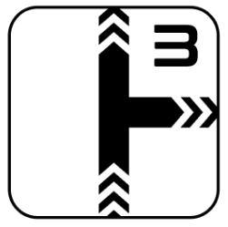
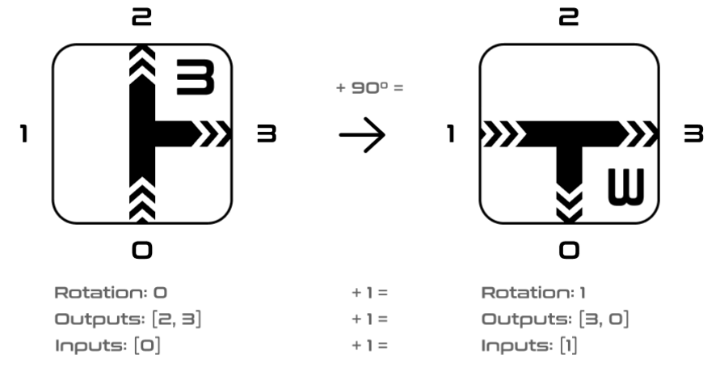

# Documento de diseño del sistema

## Introducción

Este proyecto trata de la implementación web del juego End of Line, con el objetivo de ofrecer una versión accesible y entretenida del juego de mesa. End of Line es un juego de estrategia por turnos de 1 a 8 jugadores en el que la duración de las partidas varía según el número de jugadores y el modo de juego, pero suelen rondar los 5-15 minutos. El objetivo es simple, cortar la línea del rival antes de que él corte la tuya. 

En una partida cada jugador empieza con un mazo cuyo tamaño depende del número de jugadores que haya en la partida, y una mano en la que normalmente habrá 5 cartas. En la primera ronda cada jugador coloca una sola carta en su turno, en todas las rondas posteriores cada jugador está obligado a colocar dos cartas que continúen el flujo desde la última carta que colocaron (salvo que se usen poderes de los cuales se habla más adelante). 

Para decidir el orden de los turnos en la primera ronda cada jugador debe ver el número de iniciativa que tiene la primera carta de su mazo (el número que aparece en la esquina superior derecha de cada carta), el jugador que tenga el **menor** número de iniciativa será el primero en poner cartas, si hay empate se repite este proceso hasta resolverlo. En las rondas posteriores se compararán las iniciativas de la última carta que cada jugador haya colocado, de nuevo el jugador que tenga el número de iniciativa **más bajo** será el primero en jugar sus cartas en la siguiente ronda, si hay empate se va comparando la iniciativa de la última carta que colocó cada jugador en las rondas anteriores. Una ronda acaba cuando todos los jugadores han colocado sus dos cartas.

Cuando uno de los jugadores no puede colocar alguna de las dos cartas, se considera que su línea se ha cortado y pierde la partida. Existen numerosos modos de juego, de los cuales se van a implementar:

* **Versus/Battle Royale:** es el modo de juego clásico, se juega en un tablero de 7x7 en el que los límites están conectados, es decir, si el flujo de un jugador se sale por la derecha del tablero, puede continuar por la izquierda. El jugador que no pueda continuar su línea queda eliminado de la partida.
* **Team Battle:** sigue la misma dinámica que el modo versus, pero los jugadores están divididos en dos equipos, cada equipo debe cortar la línea de todos los miembros del equipo rival. Este modo además añade una nueva mecánica, utilizando 1 punto de energía los jugadores pueden saltar **una carta de línea** del flujo que haya formado cualquier miembro de su equipo. Es importante destacar que aunque sea por equipos, cada jugador tiene su propia línea y no puede continuar la de sus compañeros de equipo.
* **Puzle solitario:** este es un modo de juego para un solo jugador que consiste en rellenar un tablero de 5x5 (en cuanto a los límites pasa igual que en el modo versus) sin cortar tu propia línea, el objetivo es alcanzar la máxima puntuación posible. La puntuación se calcula sumando las iniciativas de las cartas colocadas al final de la partida más los puntos de energía no consumidos. También existen tableros predefinidos con casillas bloqueadas por las que no se puede pasar, para añadir dificultad al reto.

Los jugadores disponen de 3 puntos de energía, los cuales no se podrán utilizar hasta la cuarta ronda. Estos puntos de energía permiten utilizar poderes que proporcionarán al jugador cierta ventaja estratégica durante la ronda en la que se activen, solo se puede gastar un punto de energía por ronda, los poderes quedan recogidos en el siguiente listado:

* **Acelerón:** permite colocar tres cartas en lugar de dos
* **Frenazo:** permite colocar una carta en lugar de dos
* **Marcha atrás:** permite continuar el flujo por la penúltima carta que se colocó, en lugar de por la última carta
* **Gas extra:** permite añadir una carta más a la mano del jugador durante una ronda

Cada jugador dispone de una carta que muestra cuántos puntos de energía le quedan, deben girarla 90 grados cada vez que se use un poder.
Una partida finaliza cuando todos los jugadores han sido eliminados, o lo que es lo mismo, no han podido continuar su línea durante su turno.

[Enlace al vídeo de explicación de las reglas del juego / partida jugada por el grupo](https://www.youtube.com/watch?v=BimBk3iC7rs)

## Diagrama(s) UML:

### Diagrama de Dominio/Diseño

```mermaid
---
title: End Of Line
---
classDiagram
    class BaseEntity {
        <<abstract>>
        #id Integer
        +getId() Integer
        +setId(Integer id)
        +isNew() Boolean
    }
    class Authorities {
        +authority String (Length(20))
        +getAuthority() String
        +setAuthority(String authority)
    }
    class Metric {
        +GAMES_PLAYED
        +VICTORIES
    }
    <<enumeration>> Metric
    class Achievement {
        +name String (NotNull, NotBlank)
        +description String
        +image String
        +threshold Integer (Min(0))
        +metric Metric
    }
    class User {
        +username String
        +password String
        +image String
        +authority Authorities (NotNull)
        +achievements List~Achievement~ (NotNull)
        +friends List~User~ (NotNull)
        +getUserName() String
        +getPassword() String
        +getImage() String
        +getAuthority() Authorities
        +getAchievements() List~Achievement~
        +getFriends() List~User~
        +setUserName(String username)
        +setPassword(String password)
        +setImage(String image)
        +setAuthority(Authorities authority)
        +setAchievements(List~Achievement~ achievements)
        +setFriends(List~User~ friends)
        -prePersist()
        +hasAuthority(String auth) Boolean
        +hasAnyAuthority(String... authorities) Boolean
    }
    class Hand {
        +numCards Integer (Min(0))
        +cards List~Card~
        +getNumCards() Integer
        +getCards() List~Card~
        +setNumCards(Integer numCards)
        +setCards(List~Card~ cards)
        -prePersist()
    }
    class TypeCard {
        TIPO_1
        TIPO_2_IZQ
        TIPO_2_DER
        TIPO_3_IZQ
        TIPO_3_DER
        TIPO_4
        TIPO_5
        TIPO_0
        INICIO
    }
    <<enumeration>> TypeCard
    class Card {
        +type TypeCard (NotNull)
        +iniciative Integer (Min(0), Max(5))
        +rotation Integer (Min(0), Max(3), NotNull)
        +player Player (NotNull)
        +output Output
        +outputs List~Integer~
        +input Integer
        +getType() TypeCard
        +getIniciative() Integer
        +getRotation() Integer
        +getPlayer() Player
        +getOutput() Output
        +getOutputs() List~Integer~
        +getInput() Integer
        +setType(TypeCard type)
        +setIniciative(Integer iniciative)
        +setRotation(Integer rotation)
        +setPlayer(Player player)
        +setOutput(Output output)
        +setOutputs(List~Integer~ outputs)
        +setInput(Integer input)
        -prePersist()
        +createByType(TypeCard type, Player player) Card$
    }
    class PackCard {
        +numCards Integer (Min(0), Max(25))
        +cards List~Card~
        +getNumCards() Integer
        +getCards() List~Card~
        +setNumCards(Integer numCards)
        +setCards(List~Card~ cards)
        -prePersist()
    }
    class PlayerState {
        PLAYING
        WON
        LOST
    }
    <<enumeration>> PlayerState
    class Player {
        +score Integer (Min(0))
        +energy Integer (Min(0), Max(3), NotNull)
        +state PlayerState
        +user User (NotNull)
        +playedCards List~Integer~
        +turnStarted LocalDateTime
        +handChanged Boolean
        +cardsPlayedThisTurn Integer
        +hand Hand (NotNull)
        +packCards List~PackCard~ (NotNull)
        +getScore() Integer
        +getEnergy() Integer
        +getState() PlayerState
        +getUser() User
        +getPlayedCards() List~Integer~
        +getTurnStarted() LocalDateTime
        +getHandChanged() Boolean
        +getCardsPlayedThisTurn() Integer
        +gettHand() Hand
        +getPackCards() List~PackCard~
        +setScore(Integer score)
        +setEnergy(Integer energy)
        +setState(PlayerState state)
        +setUser(User user)
        +setPlayedCards( List~Integer~ playedCards)
        +setTurnStarted(LocalDateTime turnStarted)
        +setHandChanged(Boolean handChanged)
        +setCardsPlayedThisTurn(Integer playedThisTurn)
        +settHand(Hand hand)
        +setPackCards(List~PackCard~ packCards)
        +canUseEnergy() Boolean
        -prePersist()
    }
    class Cell {
        +isFull Boolean (NotNull)
        +card Card
        +getIsFull() Boolean
        +getCard() Card
        +setIsFull(Boolean isFull)
        +setCard(Card card)
        -prePersist()
    }
    class Row {
        +cells List~Cell~ (NotNull)
        +getCells() List~Cell~
        +setCells(List~Cell~ cells)
    }
    class TypeTable {
        JUGADORES_1
        JUGADORES_2
        JUGADORES_3
        JUGADORES_4
        JUGADORES_5
        JUGADORES_6
        JUGADORES_7
        JUGADORES_8
    }
    <<enumeration>> TypeTable
    class TableCard {
        +type TypeTable
        +numRow Integer (Min(5), Max(13))
        +numColum Integer (Min(5), Max(13))
        +rows List~Row~ (NotNull)
        +getType() TypeTable
        +getNumRow() Integer
        +getNumColum() Integer
        +getRows() List~Row~
        +setType(TypeTable type)
        +setNumRow(Integer numRow)
        +setNumColum(Integer numColum)
        +setRows(List~Row~ rows)
        +homeNodes() Map~Integer,List~nodeCoordinates~~$
    }
    class GameState {
        WAITING
        IN_PROCESS
        END
        +value int
        +getValue() int
    }
    <<enumeration>> GameState
    class GameMode {
        VERSUS
        PUZZLE_SINGLE
        PUZZLE_COOP
        TEAM_BATTLE
        +value int
        +getValue() int
    }
    <<enumeration>> GameMode
    class ChatMessage {
        -userName String
        -messageString String
        +getUserName() String
        +getMessageString() String
        +setUserName(String userName)
        +setMessageString(String userName)
    }
    <<embeddable>> ChatMessage
    class Game {
        +gameCode String (Unique)
        +host User
        +isPublic Boolean (NotNull)
        +numPlayers Integer (NotNull, Min(1), Max(8))
        +chat List~ChatMessage~
        +nTurn Integer
        +duration Integer
        +started LocalDateTime
        +turn Integer
        +orderTurn List~Integer~
        +initialTurn List~Integer~
        +gameMode GameMode (NotNull)
        +gameState GameState
        +spectators List~Player~
        +players List~Player~
        +table TableCard
        +getGameCode() String
        +getHost() User
        +getIsPublic() Boolean
        +getNumPlayers() Integer
        +getChat() List~ChatMessage~
        +getNTurn() Integer
        +getDuration() Integer
        +getStarted() LocalDateTime
        +getTurn() Integer
        +getOrderTurn() List~Integer~
        +getInitialTurn() List~Integer~
        +getGameMode() GameMode
        +getGameState() GameState
        +getSpectators() List~Player~
        +getPlayers() List~Player~
        +getTable() TableCard
        +setGameCode(String gameCode)
        +setHost(User host)
        +setIsPublic(Boolean isPublic)
        +setNumPlayers(Integer numPlayers)
        +setChat(List~ChatMessage~ chat)
        +setNTurn(Integer nTurn)
        +setDuration(Integer duration)
        +setStarted(LocalDateTime started)
        +setTurn(Integer turn)
        +setOrderTurn(List~Integer~ orderTurn)
        +setInitialTurn(List~Integer~ initialTurn)
        +setGameMode(GameMode gameMode)
        +setGameState(GameState gameState)
        +setSpectators(List~Player~ spectators)
        +setPlayers(List~Player~ players)
        +setTable(TableCard table)
        -prePersist()
    }
    class nodeCoordinates {
        +f Integer
        +c Integer
        +rotation Integer
        +f() Integer
        +c() Integer
        +rotation() Integer
        +of(Integer f, Integer c, Integer rotation) nodeCoordinates
    }
    <<record>> nodeCoordinates
    class Output {
        +outputs List~Integer~
        +input Integer
        +outputs() List~Integer~
        +input() Integer
        +of(List~Integer~ outputs, Integer input) Output$
    }
    <<record>> Output
    class Validator {
        +validate(Object obj, Errors errors)
    }
    <<interface>> Validator
    class GameValidator {
        +validate(Object obj, Errors errors)
    }
    class UserProfileUpdateDTO {
        -newUsername String
        -newImage String
        -oldPasswordDTO String
        -newPasswordDTO String
        +getNewUserName() String
        +getNewImage() String
        +getOldPasswordDTO() String
        +getNewPasswordDTO() String
        +setNewUserName() String
        +setNewImage() String
        +setOldPasswordDTO(String oldPasswordDTO)
        +setNewPasswordDTO(String newPasswordDTO)
    }

    BaseEntity <|-- Authorities
    BaseEntity <|-- Achievement
    BaseEntity <|-- User
    BaseEntity <|-- Player
    BaseEntity <|-- Hand
    BaseEntity <|-- PackCard
    BaseEntity <|-- Card
    BaseEntity <|-- Cell
    BaseEntity <|-- Row
    BaseEntity <|-- TableCard
    BaseEntity <|-- Game
    User "*" --> "*" Achievement
    User "*" --> "1" Authorities
    User "*" <--> "*" User: isFriend
    Player *--> "1" Hand
    Player *--> "1..*" PackCard
    Hand "0..1" --> "*" Card
    PackCard "0..1" --> "*" Card
    Card "*" --> "1" Player
    Card *--> "1" Output
    Cell "0..1" --> "0..1" Card
    Row *--> "1..*" Cell
    TableCard *--> "1..*" Row
    Game "*" --> "1" User
    Game "1" --> "1..*" Player
    Game *--> "1" TableCard
    Game *--> "*" ChatMessage
    Player "*" --> "1" User
    Validator <|-- GameValidator
    GameValidator -- Game: validates
```



### Diagrama de Capas (incluyendo Controladores, Servicios y Repositorios)


## Descomposición del mockups del tablero de juego en componentes

En esta sección procesaremos el mockup del tablero de juego (o los mockups si el tablero cambia en las distintas fases del juego). Etiquetaremos las zonas de cada una de las pantallas para identificar componentes a implementar. Para cada mockup se especificará el árbol de jerarquía de componentes, así como, para cada componente el estado que necesita mantener, las llamadas a la API que debe realizar y los parámetros de configuración global que consideramos que necesita usar cada componente concreto. 
Por ejemplo, para la pantalla de visualización de métricas del usuario en un hipotético módulo de juego social:


  - App – Componente principal de la aplicación
    - $\color{orange}{\textsf{NavBar – Barra de navegación lateral}}$
      - $\color{darkred}{\textsf{[ NavButton ]. Muestra un botón de navegación con un icono asociado.}}$
    - $\color{darkblue}{\textsf{UserNotificationArea – Área de notificaciones e identificación del usuario actual}}$
    - $\color{blue}{\textsf{MetricsBar – En este componente se muestran las métricas principales del juego. Se mostrarán 4 métricas: partidas jugadas, puntos logrados, tiempo total, y cartas jugadas.}}$
      - $\color{darkgreen}{\textsf{[ MetricWell ] – Proporciona el valor y el incremento semanal de una métrica concreta. }}$
    - $\color{purple}{\textsf{GamesEvolutionChart – Muestra la tendencia de evolución en ellos últimos 4 meses en cuanto a partida jugadas, ganadas, perdidas y abandonadas.}}$
    - $\color{yellow}{\textsf{PopularCardsChart – Muestra la proporción de las N (parámetro de configuración) cartas más jugadas en el juego por el jugador.}}$
    - $\color{red}{\textsf{FrequentCoPlayersTable – Muestra los jugadores  con los que más se  ha jugado (de M en M donde M es un parámetro definido por la configuración del componente). Concretamente, se mostrarán la el nombre, la fecha de la última partida, la localización del jugador el porcentaje de partidas jugadas por ambos en las que el usuario ha ganado y si el jugador es amigo o no del usuario.}}$

## Documentación de las APIs
Se considerará parte del documento de diseño del sistema la documentación generada para las APIs, que debe incluir como mínimo, una descripción general de las distintas APIs/tags  proporcionadas. Una descripción de los distintos endpoints y operaciones soportadas. Y la especificación de las políticas de seguridad especificadas para cada endpoint y operación. Por ejemplo: “la operación POST sobre el endpoint /api/v1/game, debe realizarse por parte de un usuario autenticado como Player”.

Si lo desea puede aplicar la aproximación descrita en https://vmaks.github.io/2020/02/09/how-to-export-swagger-specification-as-html-or-word-document/ para generar una versión en formato Word de la especificación de la API generada por OpenAPI, colgarla en el propio repositorio y enlazarla en esta sección del documento.  En caso contrario debe asegurarse de que la interfaz de la documentación open-api de su aplicación está accesible, funciona correctamente, y está especificada conforme a las directrices descritas arriba.

## Patrones de diseño y arquitectónicos aplicados
En esta sección de especificar el conjunto de patrones de diseño y arquitectónicos aplicados durante el proyecto. Para especificar la aplicación de cada patrón puede usar la siguiente plantilla:

### Patrón: < Nombre del patrón >
*Tipo*: Arquitectónico | de Diseño

*Contexto de Aplicación*

Describir las partes de la aplicación donde se ha aplicado el patrón. Si se considera oportuno especificar el paquete donde se han incluido los elementos asociados a la aplicación del patrón.

*Clases o paquetes creados*

Indicar las clases o paquetes creados como resultado de la aplicación del patrón.

*Ventajas alcanzadas al aplicar el patrón*

Describir porqué era interesante aplicar el patrón.

## Decisiones de diseño
_En esta sección describiremos las decisiones de diseño que se han tomado a lo largo del desarrollo de la aplicación que vayan más allá de la mera aplicación de patrones de diseño o arquitectónicos._

### Sistema de rotación de carta
#### Descripción del problema:*

Describir el problema de diseño que se detectó, o el porqué era necesario plantearse las posibilidades de diseño disponibles para implementar la funcionalidad asociada a esta decisión de diseño.

#### Alternativas de solución evaluadas:
Especificar las distintas alternativas que se evaluaron antes de seleccionar el diseño concreto implementado finalmente en el sistema. Si se considera oportuno se pude incluir las ventajas e inconvenientes de cada alternativa

#### Justificación de la solución adoptada

Describir porqué se escogió la solución adoptada. Si se considera oportuno puede hacerse en función de qué  ventajas/inconvenientes de cada una de las soluciones consideramos más importantes.
Os recordamos que la decisión sobre cómo implementar las distintas reglas de negocio, cómo informar de los errores en el frontend, y qué datos devolver u obtener a través de las APIs y cómo personalizar su representación en caso de que sea necesario son decisiones de diseño relevantes.

### Decisión 1: Sistema de rotación de cartas:
#### Descripción del problema:

Este es el aspecto de una carta cualquiera de End of Line:



Para la lógica de juego era esencial pensar un sistema para determinar cómo una carta se puede conectar a la siguiente según su rotación. Decidimos llamar a estas posiciones Inputs (si la flecha apunta hacia el centro de la carta) y Outputs (si la flecha apunta hacia fuera de la carta). Tras analizar las cartas del juego, observamos que todas las cartas tienen sólo una Input que se sitúa en la posición de abajo.

#### Alternativas de solución evaluadas:

*Alternativa 1.a*: Definir Inputs y Outputs como coordenadas absolutas

*Ventajas:*
Permitiría una interpretación directa de las posiciones de conexión de cada carta sin depender de su rotación, simplificando el cálculo de conexiones.

*Inconvenientes:*
Requiere almacenar todas las posiciones posibles en un estado "sin rotación" y recalcular todas al aplicar cualquier giro, lo cual consume recursos innecesarios y complica el diseño.

*Alternativa 1.b*: Usar una lista para Inputs y Outputs, con ajuste dinámico mediante un atributo de rotación

*Ventajas:*
Reduce la información necesaria a almacenar en cada carta al limitar los datos a una lista de Outputs y un Input fijo. Al aplicar la rotación, es posible recalcular dinámicamente las conexiones sin alterar la base de datos.

*Inconvenientes:*
Requiere realizar operaciones de rotación cada vez que se consultan las conexiones, lo que introduce un cálculo adicional, aunque mínimo.

*Alternativa 1.c*: Incluir un mapeo predefinido de conexiones para cada posible rotación de carta

*Ventajas:*
Facilitaría el acceso rápido a las posiciones de Input y Output en función de la rotación, evitando cálculos dinámicos.

*Inconvenientes:*
Necesita más espacio de almacenamiento, ya que habría que predefinir y guardar todas las posiciones posibles para cada rotación, resultando en una mayor complejidad en la configuración inicial.

*Justificación de la solución adoptada:*
Tras varias lluvias de ideas, determinamos que la forma más eficiente de organizar este sistema sería colocando sólo una lista para Outputs en los atributos de cada carta (“outputs”), puesto que el Input siempre se situará en la misma posición. Cada Output es un número entero del 0 al 3, ordenándose en cada una de las direcciones cardinales de la carta en sentido horario, estando el 0 en la posición de abajo. Esta lista tomaría la forma de [2, 3] para la carta del ejemplo. Como las cartas pueden ser rotadas, también tenemos un atributo “rotation” cuyo rango también es del 0 al 3, representando cada incremento de éste un giro de 90º. Para calcular los outputs y el input final de cada carta basta simplemente con sumarle a cada Input y Output el atributo rotation, y hacerle el módulo en base 4. Este cálculo es dinámico y no se guarda en la base de datos, puesto que con tener el atributo de rotation siempre se podrá calcular.

Aquí se muestra una representación visual completa del sistema explicado:



### Decisión 2: Cálculo posiciones posibles:
#### Descripción del problema:

Inicialmente, el diseño preveía una solicitud `PATCH` desde el cliente al backend cada vez que un jugador intentaba colocar una carta en el tablero. En este flujo, el cliente proporcionaba la posición deseada de la carta y el backend verificaba si esta era legal. Si la posición no era válida, se rechazaba la solicitud con un error y se solicitaba al cliente otro intento.

Este enfoque presentaba varios inconvenientes. La verificación de cada posición desde el backend generaba latencia en la respuesta, lo que impactaba negativamente la experiencia del usuario. Idealmente, el cliente debería ser capaz de identificar de antemano si una posición es válida, evitando enviar solicitudes erróneas al backend. Sin embargo, para implementar esta funcionalidad, se requeriría realizar cálculos de posiciones válidas directamente en el frontend, en un entorno bidimensional. Esto implicaría una refactorización significativa del componente `Board`, dado que actualmente solo funciona con índices y no con coordenadas. Además, React no está optimizado para realizar cálculos de esta naturaleza.

#### Alternativas de solución evaluadas:

*Alternativa 1.a*: Mantener la validación en el backend con solicitudes `PATCH` para cada intento de colocación

*Ventajas:*
Evita la necesidad de refactorizar el frontend y el backend.

*Inconvenientes:*
Todas las previamente mencionadas.

*Alternativa 1.b*: Implementar cálculos de posiciones válidas en el frontend

*Ventajas:*
El cliente podría identificar inmediatamente si un movimiento es válido, mejorando la experiencia del usuario.

*Inconvenientes:*
Exige una refactorización importante del componente `Board`, además de sobrecargar al frontend con cálculos en 2D para los que React no está optimizado.

*Alternativa 1.c*: Calcular posiciones posibles en el backend y enviar una lista de posiciones válidas al frontend

Esta alternativa surgió al continuar el desarrollo y percatarnos de que el backend necesita una función para calcular **todos** los movimientos posibles de un jugador.

*Ventajas:*
Optimiza la comunicación entre frontend y backend al permitir que el cliente conozca de antemano las posiciones legales para el siguiente turno. Esto reduce las solicitudes innecesarias y permite resaltar visualmente las posiciones válidas en la interfaz de usuario. Además facilita la validación del `PATCH`.

*Inconvenientes:*
Requiere almacenar y actualizar la lista de posiciones posibles para cada jugador en cada turno, lo cual añade un paso adicional en el cálculo de posibles movimientos.

*Justificación de la solución adoptada:*
Conforme continuó el desarrollo del proyecto caímos en cuenta que es necesaria una función en el backend que calcule los movimientos posibles de un jugador para, si no tuviera movimientos posibles, marcarlo como que ha perdido la partida. Esta función fue la clave para resolver el problema. Sólo sería necesario tener un atributo por jugador, una lista de “posiciones posibles” para el siguiente turno, y pasarle esta información al frontend para que éste no realice peticiones PATCH con posiciones que no se encuentren en la lista. Y así en el backend, para determinar si la posición es válida, sólo tenemos que comprobar si la posición enviada por el frontend se encuentra en la lista de posiciones posibles. Además podemos usar esta lista para resaltar de forma visual las posiciones posibles en la interfaz de usuario.

_Ejemplos de uso de la plantilla con otras decisiones de diseño:_

### Decisión 3: Sistema de drag and drop
#### Descripción del problema:

*(Para este problema no se escogió entre alternativas como tal. Simplemente, a falta de confianza en nuestras habilidades, se implementaron todas las alternativas de más simple a más compleja, hasta que fueramos incapaces de mejorar más el sistema o implementáramos el objetivo final, que era la funcionalidad completa de drag and drop.)*

Inicialmente, hubo un debate dentro del equipo sobre si implementar o no una funcionalidad de drag and drop para que los jugadores pudieran arrastrar y soltar las cartas en el tablero. Algunos miembros expresaron su desacuerdo, sugiriendo que sería mejor un enfoque en el cual las cartas se seleccionaran y rotaran manualmente, y luego se colocaran mediante un click en la posición deseada. Estos miembros argumentaban que drag and drop podía ser demasiado complejo de implementar y que agregar rotación al proceso de arrastre podría ser problemático a nivel técnico puesto que ninguno de los miembros tenemos experiencia previa real con React.

A pesar de estas preocupaciones, el equipo decidió probar un drag and drop básico utilizando el atributo draggable de HTML. Esta implementación inicial logró que las cartas pudieran moverse, pero tenía demasiadas limitaciones. En primer lugar, el diseño no se integraba bien visualmente con el resto de la interfaz de usuario y no cumplía con las expectativas en términos de experiencia de usuario. Además, la rotación de las cartas durante el arrastre, que es una funcionalidad esencial para la experiencia del juego, era imposible de añadir con esta implementación.

Finalmente, se logró implementar una funcionalidad de drag and drop visualmente atractiva y funcional sin recurrir a ninguna librería externa, que permite que las cartas roten automáticamente al arrastrarse sobre las casillas, creando una experiencia de usuario intuitiva y fluida. 

De forma **muy resumida**, la parte visual del sistema funciona gracias a un elemento por cada carta llamado ``CardOverlay`` de posición ``fixed``, que se encarga de toda la representación visual de la carta. A este elemento, cuando no se está arrastrando su carta correspondiente, se le pasa la posición absoluta en el *viewport* de la carta real (que es invisible) dentro de la mano del jugador. Cuando se arrastra, la posición que se le pasa cambia a la posición del ratón, y mediante una serie de complejos cálculos y uso de *animationFrames* se le aplica una animación suave y satisfactoria. 

*(Este sistema se explicará con más detenimiento en el documento de diseño completo, en la sección para propuestas de A+)* 

## Refactorizaciones aplicadas

### Refactorización 1: 

En esta refactorización se eliminaron controladores y funciones innecesarios que se implementaron temporalmente para facilitar la prueba de rutas en el backend y se ajustaron los permisos de las APIs restantes.

#### Estado inicial del código

```Java 
class SecurityConfiguration
{
    .requestMatchers(AntPathRequestMatcher.antMatcher("/api/v1/developers")).permitAll()												
	.requestMatchers(AntPathRequestMatcher.antMatcher("/api/v1/plan")).permitAll()
	.requestMatchers(HttpMethod.GET, "/api/v1/users/games").authenticated()
	.requestMatchers(HttpMethod.GET, "/api/v1/users/currentUser").authenticated()
	.requestMatchers(AntPathRequestMatcher.antMatcher("/api/v1/users/**")).hasAuthority(ADMIN)
	.requestMatchers(HttpMethod.GET, "/api/v1/games").hasAuthority(ADMIN)
	.requestMatchers(HttpMethod.GET, "/api/v1/games/current").authenticated()
	.requestMatchers(HttpMethod.GET, "/api/v1/games/createdGame").authenticated()
	.requestMatchers(HttpMethod.GET, "/api/v1/games/*").authenticated()
	.requestMatchers(HttpMethod.POST, "/api/v1/games").authenticated()
	.requestMatchers(HttpMethod.PATCH, "/api/v1/games/{gameCode}/joinAsPlayer").authenticated()
	.requestMatchers(HttpMethod.PATCH, "/api/v1/games/{gameCode}/joinAsSpectators").authenticated()
	.requestMatchers(HttpMethod.PATCH, "/api/v1/games/{gameCode}/startGame").authenticated()
	.requestMatchers(HttpMethod.GET, "/api/v1/achievements/myAchievement").authenticated()
	.requestMatchers(HttpMethod.PUT, "/api/v1/users/update/{id}").authenticated()
	.requestMatchers(AntPathRequestMatcher.antMatcher("/api/v1/players")).authenticated()
	.requestMatchers(AntPathRequestMatcher.antMatcher("/api/v1/achievements")).hasAuthority(ADMIN)
	.requestMatchers(AntPathRequestMatcher.antMatcher("/h2-console/**")).permitAll()
	.anyRequest().authenticated()
}
```

```Java
class PackCardRestController
{
    private final PackCardService service;
    @Autowired
	public PackCardRestController(PackCardService packCardService) {
		this.service = packCardService;
	}
    
    @GetMapping
	public ResponseEntity<List<PackCard>> findAll() {
		List<PackCard> res = (List<PackCard>) service.findAll();
        return new ResponseEntity<>(res,HttpStatus.OK);
	}
    @PostMapping
    @ResponseStatus(HttpStatus.CREATED)
    public ResponseEntity<PackCard> create(@RequestBody @Valid PackCard packCard){
        PackCard savedPackCard = service.savePackCard(packCard);
        return new ResponseEntity<>(savedPackCard,HttpStatus.CREATED);
    }
    @PutMapping(value = "{packCardId}")
	@ResponseStatus(HttpStatus.OK)
	public ResponseEntity<PackCard> update(@PathVariable("packCardId") Integer id, @RequestBody @Valid PackCard packCard) {
		RestPreconditions.checkNotNull(service.findPackCard(id), "PackCard", "ID", id);
		return new ResponseEntity<>(this.service.updatePackCard(packCard, id), HttpStatus.OK);
	}
    @DeleteMapping(value = "{packCardId}")
	@ResponseStatus(HttpStatus.OK)
	public ResponseEntity<MessageResponse> delete(@PathVariable("packCardId") int id) {
		RestPreconditions.checkNotNull(service.findPackCard(id), "PackCard", "ID", id);
		service.deletePackCard(id);
		return new ResponseEntity<>(new MessageResponse("PackCard deleted!"), HttpStatus.OK);
	}
}
```
Como la clase **PackCardRestController** había otras iguales, con los mismos métodos, para cada una de las entidades.

#### Estado del código refactorizado

Las clases **RestController** mencionadas fueron eliminadas.

```Java
class SecurityConfiguration 
{
    .requestMatchers(AntPathRequestMatcher.antMatcher("/api/v1/developers")).permitAll()												
	.requestMatchers(AntPathRequestMatcher.antMatcher("/api/v1/plan")).permitAll()
	.requestMatchers(HttpMethod.GET, "/api/v1/users/games").authenticated()
    .requestMatchers(AntPathRequestMatcher.antMatcher("/api/v1/users/**")).hasAuthority(ADMIN)
	.requestMatchers(HttpMethod.GET, "/api/v1/games").hasAuthority(ADMIN)
    .requestMatchers(AntPathRequestMatcher.antMatcher("/api/v1/games/**")).authenticated()
	.requestMatchers(HttpMethod.GET, "/api/v1/achievements/myAchievement").authenticated()
    .requestMatchers(AntPathRequestMatcher.antMatcher("/api/v1/achievements/**")).hasAuthority(ADMIN)
	.requestMatchers(AntPathRequestMatcher.antMatcher("/h2-console/**")).permitAll()
	.anyRequest().authenticated()
}
```
#### Problema que nos hizo realizar la refactorización

Eran clases y métodos innecesarios que debían ser borrados y los permisos de las rutas se volvieron enrevesados y a veces se pisaban unos con otros.

#### Ventajas que presenta la nueva versión del código respecto de la versión original

Configuración del acceso a las rutas más limpio y por tanto fácil de leer y evitamos tener código inncesario con la eliminación de las clases RestController.
