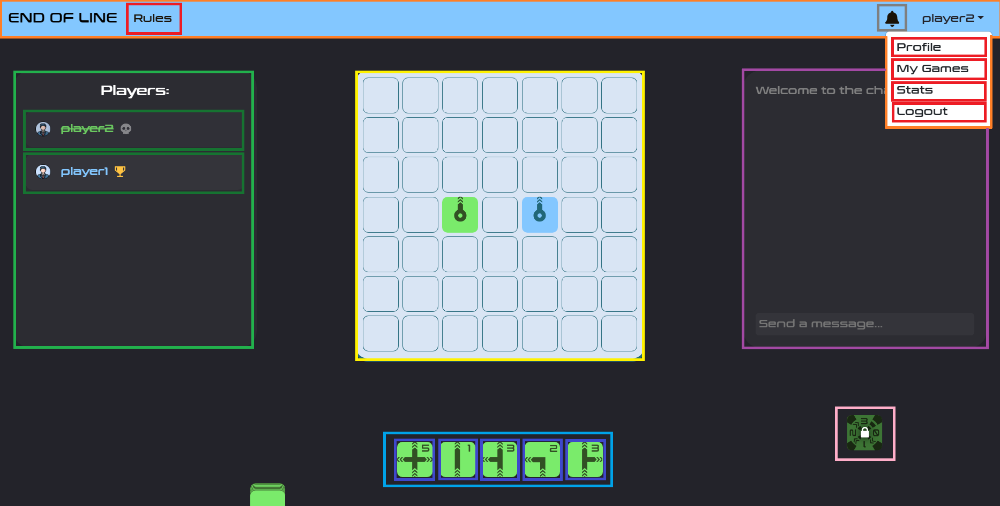

# Documento de diseño del sistema

## Introducción

Este proyecto trata de la implementación web del juego End of Line, con el objetivo de ofrecer una versión accesible y entretenida del juego de mesa. End of Line es un juego de estrategia por turnos de 1 a 8 jugadores en el que la duración de las partidas varía según el número de jugadores y el modo de juego, pero suelen rondar los 5-15 minutos. El objetivo es simple, cortar la línea del rival antes de que él corte la tuya. 

En una partida cada jugador empieza con un mazo cuyo tamaño depende del número de jugadores que haya en la partida, y una mano en la que normalmente habrá 5 cartas. En la primera ronda cada jugador coloca una sola carta en su turno, en todas las rondas posteriores cada jugador está obligado a colocar dos cartas que continúen el flujo desde la última carta que colocaron (salvo que se usen poderes de los cuales se habla más adelante). 

Para decidir el orden de los turnos en la primera ronda cada jugador debe ver el número de iniciativa que tiene la primera carta de su mazo (el número que aparece en la esquina superior derecha de cada carta), el jugador que tenga el **menor** número de iniciativa será el primero en poner cartas, si hay empate se repite este proceso hasta resolverlo. En las rondas posteriores se compararán las iniciativas de la última carta que cada jugador haya colocado, de nuevo el jugador que tenga el número de iniciativa **más bajo** será el primero en jugar sus cartas en la siguiente ronda, si hay empate se va comparando la iniciativa de la última carta que colocó cada jugador en las rondas anteriores. Una ronda acaba cuando todos los jugadores han colocado sus dos cartas.

Cuando uno de los jugadores no puede colocar alguna de las dos cartas, se considera que su línea se ha cortado y pierde la partida. Existen numerosos modos de juego, de los cuales se van a implementar:

* **Versus/Battle Royale:** es el modo de juego clásico, se juega en un tablero de 7x7 en el que los límites están conectados, es decir, si el flujo de un jugador se sale por la derecha del tablero, puede continuar por la izquierda. El jugador que no pueda continuar su línea queda eliminado de la partida.
* **Team Battle:** sigue la misma dinámica que el modo versus, pero los jugadores están divididos en dos equipos, cada equipo debe cortar la línea de todos los miembros del equipo rival. Este modo además añade una nueva mecánica, utilizando 1 punto de energía los jugadores pueden saltar **una carta de línea** del flujo que haya formado cualquier miembro de su equipo. Es importante destacar que aunque sea por equipos, cada jugador tiene su propia línea y no puede continuar la de sus compañeros de equipo.
* **Puzle solitario:** este es un modo de juego para un solo jugador que consiste en rellenar un tablero de 5x5 (en cuanto a los límites pasa igual que en el modo versus) sin cortar tu propia línea, el objetivo es alcanzar la máxima puntuación posible. La puntuación se calcula sumando las iniciativas de las cartas colocadas al final de la partida más los puntos de energía no consumidos. También existen tableros predefinidos con casillas bloqueadas por las que no se puede pasar, para añadir dificultad al reto.

Los jugadores disponen de 3 puntos de energía, los cuales no se podrán utilizar hasta la cuarta ronda. Estos puntos de energía permiten utilizar poderes que proporcionarán al jugador cierta ventaja estratégica durante la ronda en la que se activen, solo se puede gastar un punto de energía por ronda, los poderes quedan recogidos en el siguiente listado:

* **Acelerón:** permite colocar tres cartas en lugar de dos
* **Frenazo:** permite colocar una carta en lugar de dos
* **Marcha atrás:** permite continuar el flujo por la penúltima carta que se colocó, en lugar de por la última carta
* **Gas extra:** permite añadir una carta más a la mano del jugador durante una ronda

Cada jugador dispone de una carta que muestra cuántos puntos de energía le quedan, deben girarla 90 grados cada vez que se use un poder.
Una partida finaliza cuando todos los jugadores han sido eliminados, o lo que es lo mismo, no han podido continuar su línea durante su turno.

[Enlace al vídeo de explicación de las reglas del juego / partida jugada por el grupo](https://www.youtube.com/watch?v=BimBk3iC7rs)

## Diagrama(s) UML:

### Diagrama de Dominio/Diseño


### Diagrama de Capas (incluyendo Controladores, Servicios y Repositorios)

![Diagrama-de-capas](http://www.plantuml.com/plantuml/png/fPVTRjiw3CVl_HGwkraAj7k1Sr2iIOkkG3-2f3ldMhCPLvWi1PAoBXZwxiTKOeTnQBdUTh76ue_K1_-qgSy-I1SsbSx-Ac2b38Z5pUpvwl7s_aRaMdgVPMkPVvSbY0zp1nvCa45P8-xb5jm7yIiJGX2VMrd10doOMHESrHfS1_ZgmIM1g_n5mG-em8HZ3h4kkmallO6kwoZQhi7vNkJcPmvhtCuNQOhQt0l-jvozoFurB_5GV52vJsxjqGQrKdaymCHKFTWRISLquvK1xyMzBLMUIiOIt0-LG_yXyy1CkeAtu57nbdczkdw_kSP5yhPd-Kr3l-iCjEOjg2RUWjAmJWK5dWSMzhNVarZODFTi0sH5BNpc6uBcSm7URbmE_ZYLiGBt9REsNWNhjcZQ_xiGJr6zKl-3pALOALDCj_ZRo0eco-2KASLc_tn67AVMQf16m4_bWq_wf2UxAoPt9a09JgY2qdS17AQLq5TQJxTDOhRDLB8UO1rHCSHrzxXRwWJ_YujaFL7uhHy--2_MXtgot_HEkKsbL_b16T7lyFYqGgV7JHNZ_7w4wusBulcZDUnEi6SLzpKSj_vWY_ts7wmFqQTenkb1i07czXKS-jL8qOqIZS_RDRn_5mZ-g_9WdG8_pkqQLY33YTCRgIpoaXWgC88sqdyazI8RLPzEWcSt51sPH4NH314IV-F6uSvCMYCEr4JP_FHdwGdnroxKp1RjVihzC-iSvy8FuWDuBqkuF4J2qOde1lbxX5PljVqcTLinPwDTsr8PxqfgP7Hfd7gqkjsvBAJvhanvK3DJFCg4OtetD66aIzeaNbmn9C6eR9_SDVZSgPZH9kUcDfmtkIiEzhF1e5-Dt0qLnEGdvE7J0zHnSr75F-UYKJZMvTpPqe6lXNgoI-m9wFPE26n7qaJRbWnGCUzffcrJqXYsAqa2UuyqW9r4cg0TnO7yrLkkbD_NA_yo7-My15FG4ESY_lGuF2uUzWRiUjwmKVeePjOOoD71YvMpbJYzZOXW1TSOPwUN4d7nwUAIziUz3AvcY47j35Eer26cLTW0s8fwY7iFGzlM3FSxS0vz3DTpP_GznRWm5n7UWrr8XZEc0CvE-_kCNknuOMJSvQv5cJi1pxFBftNG1Rah0yVJm6HROqEp7dnmhXgvkiDwx5niCdAougAmhoQUDcsGQFwx936zpm7NJSYs6WY2OmHfgvGWE4OGMdiKQyO9IjuC58oZ1ADbJqdkYnEhRs2Vf12x934HX_Q6JKWS8qXpNoR4qMUCw9vFS1hajj6-c0Y2OmHXfDoY_2SIvOlTXpDIyxBD3-9czSgzUpd9K3ilWHGnC0F_gU1ocBAJ4-wLDHdZ66OxT6diSj8GZh7G-0aFeXrwIz1l6pTPcg1domASJcEP9jR2sFblx4Un35iDFliCfjXK-dy0)

## Descomposición del mockups del tablero de juego en componentes

 - App – Componente principal de la aplicación
    - $\color{#FF7F27}{\textsf{NavBar – Barra de navegación superior.}}$
      - $\color{#ED1C24}{\textsf{[ NavButton ]. Permite acceder a opciones del usuario y a las reglas del juego.}}$
      - $\color{#7F7F7F}{\textsf{[ NotificationButton ]. Área de notificaciones del juego.}}$

    - $\color{#22B14C}{\textsf{PlayersPanel  – Muestra la lista de jugadores de la partida.}}$
        - $\color{#167331}{\textsf{[ Player ]. Nombre del jugador con iconos asociados.}}$

    - $\color{#FFF200}{\textsf{GameBoard – En este componente se desarrollará el juego. En las celdas se colocan las cartas de cada jugador. }}$

    - $\color{#A349A4}{\textsf{Chat – Muestra los mensajes que escriben los jugadores de la partida.}}$

    - $\color{#00A2E8}{\textsf{HandCard – Muestra la mano de cartas que tiene el jugador }}$
        - $\color{#3F48CC}{\textsf{[ Card ]. Cartas que están disponibles para colocar.}}$

    - $\color{#FFAEC9}{\textsf{EnergyCard – Muestra la energía que tiene el jugador. Se desbloquea para poder utilizar los diferentes poderes.}}$


## Documentación de las APIs
Se considerará parte del documento de diseño del sistema la documentación generada para las APIs, que debe incluir como mínimo, una descripción general de las distintas APIs/tags  proporcionadas. Una descripción de los distintos endpoints y operaciones soportadas. Y la especificación de las políticas de seguridad especificadas para cada endpoint y operación. Por ejemplo: “la operación POST sobre el endpoint /api/v1/game, debe realizarse por parte de un usuario autenticado como Player”.

Si lo desea puede aplicar la aproximación descrita en https://vmaks.github.io/2020/02/09/how-to-export-swagger-specification-as-html-or-word-document/ para generar una versión en formato Word de la especificación de la API generada por OpenAPI, colgarla en el propio repositorio y enlazarla en esta sección del documento.  En caso contrario debe asegurarse de que la interfaz de la documentación open-api de su aplicación está accesible, funciona correctamente, y está especificada conforme a las directrices descritas arriba.

## Patrones de diseño y arquitectónicos aplicados
En esta sección de especificar el conjunto de patrones de diseño y arquitectónicos aplicados durante el proyecto. Para especificar la aplicación de cada patrón puede usar la siguiente plantilla:

### Patrón: < Nombre del patrón >
*Tipo*: Arquitectónico | de Diseño

*Contexto de Aplicación*

Describir las partes de la aplicación donde se ha aplicado el patrón. Si se considera oportuno especificar el paquete donde se han incluido los elementos asociados a la aplicación del patrón.

*Clases o paquetes creados*

Indicar las clases o paquetes creados como resultado de la aplicación del patrón.

*Ventajas alcanzadas al aplicar el patrón*

Describir porqué era interesante aplicar el patrón.

### Patrón: < Modelo-Vista-Controlador (MVC) >
*Tipo*: Arquitectónico

*Contexto de Aplicación*: el patrón MVC ha sido aplicado en el proyecto del juego de mesa End of Line, desarrollado con React para el frontend y Spring Boot para el backend. Este patrón organiza la lógica de negocio (controladores y servicios en el backend) y la interfaz de usuario (componentes de React en el frontend) para garantizar una separación clara de responsabilidades. Las siguientes capas corresponden al patrón:

- Modelo: representa los datos del juego y su lógica, implementados en el backend como entidades (Game, Player, etc.) y repositorios que gestionan el acceso a la base de datos.
- Vista: incluye los componentes de React en el frontend, como tableros, cartas y elementos interactivos, que renderizan la interfaz del juego.
- Controlador: implementado en Spring Boot mediante controladores REST (GameRestController), los cuales gestionan las peticiones del frontend y procesan las respuestas.

*Paquetes creados en alto nivel:* 
- frontend (relativo a la vista dentro del modelo)
- src ( relativo a los controladores y repositorios así como la lógica del juego que corresponden con el controlador y el modelo)

*Ventajas alcanzadas al aplicar el patrón*: La aplicación del patrón MVC facilita la separación de responsabilidades, lo que hace que el código sea más modular y mantenible. Cada capa (modelo, vista y controlador) puede evolucionar de manera independiente, permitiendo modificar la lógica de negocio sin afectar la interfaz de usuario, o actualizar la vista sin alterar los datos o controladores. Además, esta estructura mejora la escalabilidad del proyecto, facilita las pruebas unitarias (especialmente en el backend) y promueve la reutilización del código, ya que cada componente está claramente definido y desacoplado.

### Patrón: < Builder Jerárquico >
*Tipo*: de Diseño

*Contexto*: Dentro del juego End Of Line existe la necesidad de creación de tableros para los diferentes modos de juego existentes, los cuales pueden depender del número de jugadores o del modo de juego en sí mismo. Para la creación de un objeto tablero se plantea la duda de realizar un único constructor con todos los atributos necesarios para crear los diferentes tableros o la descomposición del mismo para fomentar la mayor cohesión dentro del proyecto. Aquí es donde entra el patrón Builder Jerárquico el cual descompone la creación de un objeto de muchos atributos en un constructor que llama a subconstructores que crean partes del tablero para que luego el constructor principal junte cada parte y cree el tablero completo. De esta forma se crean celdas que contendrán las cartas, estas celdas estarán incluidas en las llamadas filas que a su vez formarán el tablero con una lista de filas.


La parte de la aplicación donde se ha incluido este patrón es en el paquete tableCard encargado de la creación del tablero el cual cuenta con las siguientes clases relativas al patrón:

- Cell
- Row
- TableCard


*Ventajas alcanzadas al aplicar el patrón*: 
- Claridad: Divide un constructor complejo en pasos más pequeños y claros.
- Extensibilidad: Es fácil agregar nuevas configuraciones o partes al objeto sin modificar las existentes.

Aplicar el patrón Builder jerárquico es interesante porque simplifica la creación de objetos complejos al dividir el proceso en pasos más manejables y organizados. Esto mejora la claridad del código, ya que cada subconstructor se enfoca en configurar una parte específica del objeto, reduciendo la complejidad de manejar múltiples atributos en un único constructor. Además, promueve la extensibilidad, permitiendo agregar nuevas configuraciones o validaciones sin alterar la lógica existente. Por último, facilita la mantenibilidad y la reutilización, ya que las configuraciones específicas están encapsuladas en métodos o clases especializadas dentro del Builder.

### Patrón: < Hooks >
*Tipo*: de Diseño

*Contexto*: como se ha descrito anteriormente, utilizamos el patrón Modelo-Vista-Controlador, de modo que si estamos en frontend y queremos obtener datos desde el backend sin modificar la capa de presentación, los hooks son la herramienta indicada. Pero principalmente el objetivo que persigue el Patrón Hooks, y por lo que decidimos usarlo, es añadir estados a los componentes, de modo que no se tienen que estar gestionando estos continuamente y hace que el código sea más sencillo y legible. Por último, también permiten crear hooks personalizados, en la parte de clases o paquetes creados se dan ejemplos en el proyecto.

Este patrón se ha aplicado en prácticamente todos los ficheros de código del paquete frontend, es decir, se utiliza para todas las pantallas debido a su utilidad para obtener datos del backend.

*Clases o paquetes creados*: la aplicación de este patrón ha derivado en la utilización de 2 hooks personalizados: useFetchState y useFetchData.

*Ventajas alcanzadas al aplicar el patrón*:
- Claridad del código: no es necesario repetir en todos los componentes, o incluso varias veces en el mismo, la lógica necesaria para actualizar los estados de estos.
- Personalización: la posibilidad de crear hooks personalizados, adaptados a las necesidades de los desarrolladores, permite una gestión mucho más sencilla de los estados de los componentes.
- Aislamiento: permite hacer cosas como obtener datos del backend sin afectar a la capa de presentación, o la vista en MVC.

Aplicar el patrón hooks es interesante porque resuelve el problema de la gestión de los estados de los componentes en el frontend de una manera sencilla, su flexibilidad y personalización permite simplificar mucho el código, eliminando la necesidad de repetir trozos de código que gestionen los estados de los componentes, lo cual hace que el código sea más fácil de desarrollar, y de mantener posteriormente. Además, es una herramienta bastante útil para obtener la información necesaria del backend y poder mostrársela al usuario.

### Patrón: < Composite >
*Tipo*: de Diseño

*Contexto de Aplicación*: en este proyecto se tienen por un lado cartas; entidades individuales, y por otro lado mazos o manos; que también son entidades individuales. El tratamiento de todas esas entidades sería en principio diferente, cuando realmente las segundas son agrupaciones de la primera, esto es poco uniforme. Para mejorar este tratamiento se utiliza el patrón Composite, que permite tratar objetos individuales (cartas) y objetos compuestos de esos objetos individuales (mazos o manos) de la misma forma, de modo que no es necesario diferenciar constantemente entre los dos casos en el código.

Este patrón se aplica a las entidades Card, Hand y PackCard.

*Ventajas alcanzadas al aplicar el patrón*:
- Uniformidad: tanto las cartas como colecciones de estas se tratan de forma uniforme.
- Flexibilidad: la aplicación de este patrón permite añadir nuevas funcionalidades sin necesidad de modificar la estructura básica de las entidades.

Es interesante aplicar este patrón porque permite realizar operaciones sobre cartas y colecciones de ellas (como barajar o buscar cartas) con relativa facilidad, sin tener que hacer cambios en la definición de las entidades de la base de datos, lo cual podría hacer que gran parte del código que tenga que ver con esas entidades funcionase mal.

## Decisiones de diseño
_En esta sección describiremos las decisiones de diseño que se han tomado a lo largo del desarrollo de la aplicación que vayan más allá de la mera aplicación de patrones de diseño o arquitectónicos._

### Nombre problema
#### Descripción del problema:*

Describir el problema de diseño que se detectó, o el porqué era necesario plantearse las posibilidades de diseño disponibles para implementar la funcionalidad asociada a esta decisión de diseño.

#### Alternativas de solución evaluadas:
Especificar las distintas alternativas que se evaluaron antes de seleccionar el diseño concreto implementado finalmente en el sistema. Si se considera oportuno se pude incluir las ventajas e inconvenientes de cada alternativa

#### Justificación de la solución adoptada

Describir porqué se escogió la solución adoptada. Si se considera oportuno puede hacerse en función de qué  ventajas/inconvenientes de cada una de las soluciones consideramos más importantes.
Os recordamos que la decisión sobre cómo implementar las distintas reglas de negocio, cómo informar de los errores en el frontend, y qué datos devolver u obtener a través de las APIs y cómo personalizar su representación en caso de que sea necesario son decisiones de diseño relevantes.

### Decisión 1: Sistema de rotación de cartas:
#### Descripción del problema:

Este es el aspecto de una carta cualquiera de End of Line:


Para la lógica de juego era esencial pensar un sistema para determinar cómo una carta se puede conectar a la siguiente según su rotación. Decidimos llamar a estas posiciones Inputs (si la flecha apunta hacia el centro de la carta) y Outputs (si la flecha apunta hacia fuera de la carta). Tras analizar las cartas del juego, observamos que todas las cartas tienen sólo una Input que se sitúa en la posición de abajo.

#### Alternativas de solución evaluadas:

*Alternativa 1.a*: Definir Inputs y Outputs como coordenadas absolutas

*Ventajas:*
Permitiría una interpretación directa de las posiciones de conexión de cada carta sin depender de su rotación, simplificando el cálculo de conexiones.

*Inconvenientes:*
Requiere almacenar todas las posiciones posibles en un estado "sin rotación" y recalcular todas al aplicar cualquier giro, lo cual consume recursos innecesarios y complica el diseño.

*Alternativa 1.b*: Usar una lista para Inputs y Outputs, con ajuste dinámico mediante un atributo de rotación

*Ventajas:*
Reduce la información necesaria a almacenar en cada carta al limitar los datos a una lista de Outputs y un Input fijo. Al aplicar la rotación, es posible recalcular dinámicamente las conexiones sin alterar la base de datos.

*Inconvenientes:*
Requiere realizar operaciones de rotación cada vez que se consultan las conexiones, lo que introduce un cálculo adicional, aunque mínimo.

*Alternativa 1.c*: Incluir un mapeo predefinido de conexiones para cada posible rotación de carta

*Ventajas:*
Facilitaría el acceso rápido a las posiciones de Input y Output en función de la rotación, evitando cálculos dinámicos.

*Inconvenientes:*
Necesita más espacio de almacenamiento, ya que habría que predefinir y guardar todas las posiciones posibles para cada rotación, resultando en una mayor complejidad en la configuración inicial.

*Justificación de la solución adoptada:*
Tras varias lluvias de ideas, determinamos que la forma más eficiente de organizar este sistema sería colocando sólo una lista para Outputs en los atributos de cada carta (“outputs”), puesto que el Input siempre se situará en la misma posición. Cada Output es un número entero del 0 al 3, ordenándose en cada una de las direcciones cardinales de la carta en sentido horario, estando el 0 en la posición de abajo. Esta lista tomaría la forma de [2, 3] para la carta del ejemplo. Como las cartas pueden ser rotadas, también tenemos un atributo “rotation” cuyo rango también es del 0 al 3, representando cada incremento de éste un giro de 90º. Para calcular los outputs y el input final de cada carta basta simplemente con sumarle a cada Input y Output el atributo rotation, y hacerle el módulo en base 4. Este cálculo es dinámico y no se guarda en la base de datos, puesto que con tener el atributo de rotation siempre se podrá calcular.

Aquí se muestra una representación visual completa del sistema explicado:


### Decisión 2: Cálculo posiciones posibles:
#### Descripción del problema:

Inicialmente, el diseño preveía una solicitud `PATCH` desde el cliente al backend cada vez que un jugador intentaba colocar una carta en el tablero. En este flujo, el cliente proporcionaba la posición deseada de la carta y el backend verificaba si esta era legal. Si la posición no era válida, se rechazaba la solicitud con un error y se solicitaba al cliente otro intento.

Este enfoque presentaba varios inconvenientes. La verificación de cada posición desde el backend generaba latencia en la respuesta, lo que impactaba negativamente la experiencia del usuario. Idealmente, el cliente debería ser capaz de identificar de antemano si una posición es válida, evitando enviar solicitudes erróneas al backend. Sin embargo, para implementar esta funcionalidad, se requeriría realizar cálculos de posiciones válidas directamente en el frontend, en un entorno bidimensional. Esto implicaría una refactorización significativa del componente `Board`, dado que actualmente solo funciona con índices y no con coordenadas. Además, React no está optimizado para realizar cálculos de esta naturaleza.

#### Alternativas de solución evaluadas:

*Alternativa 1.a*: Mantener la validación en el backend con solicitudes `PATCH` para cada intento de colocación

*Ventajas:*
Evita la necesidad de refactorizar el frontend y el backend.

*Inconvenientes:*
Todas las previamente mencionadas.

*Alternativa 1.b*: Implementar cálculos de posiciones válidas en el frontend

*Ventajas:*
El cliente podría identificar inmediatamente si un movimiento es válido, mejorando la experiencia del usuario.

*Inconvenientes:*
Exige una refactorización importante del componente `Board`, además de sobrecargar al frontend con cálculos en 2D para los que React no está optimizado.

*Alternativa 1.c*: Calcular posiciones posibles en el backend y enviar una lista de posiciones válidas al frontend

Esta alternativa surgió al continuar el desarrollo y percatarnos de que el backend necesita una función para calcular **todos** los movimientos posibles de un jugador.

*Ventajas:*
Optimiza la comunicación entre frontend y backend al permitir que el cliente conozca de antemano las posiciones legales para el siguiente turno. Esto reduce las solicitudes innecesarias y permite resaltar visualmente las posiciones válidas en la interfaz de usuario. Además facilita la validación del `PATCH`.

*Inconvenientes:*
Requiere almacenar y actualizar la lista de posiciones posibles para cada jugador en cada turno, lo cual añade un paso adicional en el cálculo de posibles movimientos.

*Justificación de la solución adoptada:*
Conforme continuó el desarrollo del proyecto caímos en cuenta que es necesaria una función en el backend que calcule los movimientos posibles de un jugador para, si no tuviera movimientos posibles, marcarlo como que ha perdido la partida. Esta función fue la clave para resolver el problema. Sólo sería necesario tener un atributo por jugador, una lista de “posiciones posibles” para el siguiente turno, y pasarle esta información al frontend para que éste no realice peticiones PATCH con posiciones que no se encuentren en la lista. Y así en el backend, para determinar si la posición es válida, sólo tenemos que comprobar si la posición enviada por el frontend se encuentra en la lista de posiciones posibles. Además podemos usar esta lista para resaltar de forma visual las posiciones posibles en la interfaz de usuario.

### Decisión 3: Sistema de drag and drop
#### Descripción del problema:

*(Para este problema no se escogió entre alternativas como tal. Simplemente, a falta de confianza en nuestras habilidades, se implementaron todas las alternativas de más simple a más compleja, hasta que fueramos incapaces de mejorar más el sistema o implementáramos el objetivo final, que era la funcionalidad completa de drag and drop.)*

Inicialmente, hubo un debate dentro del equipo sobre si implementar o no una funcionalidad de drag and drop para que los jugadores pudieran arrastrar y soltar las cartas en el tablero. Algunos miembros expresaron su desacuerdo, sugiriendo que sería mejor un enfoque en el cual las cartas se seleccionaran y rotaran manualmente, y luego se colocaran mediante un click en la posición deseada. Estos miembros argumentaban que drag and drop podía ser demasiado complejo de implementar y que agregar rotación al proceso de arrastre podría ser problemático a nivel técnico puesto que ninguno de los miembros tenemos experiencia previa real con React.

A pesar de estas preocupaciones, el equipo decidió probar un drag and drop básico utilizando el atributo draggable de HTML. Esta implementación inicial logró que las cartas pudieran moverse, pero tenía demasiadas limitaciones. En primer lugar, el diseño no se integraba bien visualmente con el resto de la interfaz de usuario y no cumplía con las expectativas en términos de experiencia de usuario. Además, la rotación de las cartas durante el arrastre, que es una funcionalidad esencial para la experiencia del juego, era imposible de añadir con esta implementación.

Finalmente, se logró implementar una funcionalidad de drag and drop visualmente atractiva y funcional sin recurrir a ninguna librería externa, que permite que las cartas roten automáticamente al arrastrarse sobre las casillas, creando una experiencia de usuario intuitiva y fluida. 

De forma **muy resumida**, la parte visual del sistema funciona gracias a un elemento por cada carta llamado ``CardOverlay`` de posición ``fixed``, que se encarga de toda la representación visual de la carta. A este elemento, cuando no se está arrastrando su carta correspondiente, se le pasa la posición absoluta en el *viewport* de la carta real (que es invisible) dentro de la mano del jugador. Cuando se arrastra, la posición que se le pasa cambia a la posición del ratón, y mediante una serie de complejos cálculos y uso de *animationFrames* se le aplica una animación suave y satisfactoria. 

*(Este sistema se explicará con más detenimiento en el documento de diseño completo, en la sección para propuestas de A+)* 

## Refactorizaciones aplicadas

### Refactorización 1: 

En esta refactorización se eliminaron controladores y funciones innecesarios que se implementaron temporalmente para facilitar la prueba de rutas en el backend y se ajustaron los permisos de las APIs restantes.

#### Estado inicial del código

```Java 
class SecurityConfiguration
{
    .requestMatchers(AntPathRequestMatcher.antMatcher("/api/v1/developers")).permitAll()												
	.requestMatchers(AntPathRequestMatcher.antMatcher("/api/v1/plan")).permitAll()
	.requestMatchers(HttpMethod.GET, "/api/v1/users/games").authenticated()
	.requestMatchers(HttpMethod.GET, "/api/v1/users/currentUser").authenticated()
	.requestMatchers(AntPathRequestMatcher.antMatcher("/api/v1/users/**")).hasAuthority(ADMIN)
	.requestMatchers(HttpMethod.GET, "/api/v1/games").hasAuthority(ADMIN)
	.requestMatchers(HttpMethod.GET, "/api/v1/games/current").authenticated()
	.requestMatchers(HttpMethod.GET, "/api/v1/games/createdGame").authenticated()
	.requestMatchers(HttpMethod.GET, "/api/v1/games/*").authenticated()
	.requestMatchers(HttpMethod.POST, "/api/v1/games").authenticated()
	.requestMatchers(HttpMethod.PATCH, "/api/v1/games/{gameCode}/joinAsPlayer").authenticated()
	.requestMatchers(HttpMethod.PATCH, "/api/v1/games/{gameCode}/joinAsSpectators").authenticated()
	.requestMatchers(HttpMethod.PATCH, "/api/v1/games/{gameCode}/startGame").authenticated()
	.requestMatchers(HttpMethod.GET, "/api/v1/achievements/myAchievement").authenticated()
	.requestMatchers(HttpMethod.PUT, "/api/v1/users/update/{id}").authenticated()
	.requestMatchers(AntPathRequestMatcher.antMatcher("/api/v1/players")).authenticated()
	.requestMatchers(AntPathRequestMatcher.antMatcher("/api/v1/achievements")).hasAuthority(ADMIN)
	.requestMatchers(AntPathRequestMatcher.antMatcher("/h2-console/**")).permitAll()
	.anyRequest().authenticated()
}
```

```Java
class PackCardRestController
{
    private final PackCardService service;
    @Autowired
	public PackCardRestController(PackCardService packCardService) {
		this.service = packCardService;
	}
    
    @GetMapping
	public ResponseEntity<List<PackCard>> findAll() {
		List<PackCard> res = (List<PackCard>) service.findAll();
        return new ResponseEntity<>(res,HttpStatus.OK);
	}
    @PostMapping
    @ResponseStatus(HttpStatus.CREATED)
    public ResponseEntity<PackCard> create(@RequestBody @Valid PackCard packCard){
        PackCard savedPackCard = service.savePackCard(packCard);
        return new ResponseEntity<>(savedPackCard,HttpStatus.CREATED);
    }
    @PutMapping(value = "{packCardId}")
	@ResponseStatus(HttpStatus.OK)
	public ResponseEntity<PackCard> update(@PathVariable("packCardId") Integer id, @RequestBody @Valid PackCard packCard) {
		RestPreconditions.checkNotNull(service.findPackCard(id), "PackCard", "ID", id);
		return new ResponseEntity<>(this.service.updatePackCard(packCard, id), HttpStatus.OK);
	}
    @DeleteMapping(value = "{packCardId}")
	@ResponseStatus(HttpStatus.OK)
	public ResponseEntity<MessageResponse> delete(@PathVariable("packCardId") int id) {
		RestPreconditions.checkNotNull(service.findPackCard(id), "PackCard", "ID", id);
		service.deletePackCard(id);
		return new ResponseEntity<>(new MessageResponse("PackCard deleted!"), HttpStatus.OK);
	}
}
```
Como la clase **PackCardRestController** había otras iguales, con los mismos métodos, para cada una de las entidades.
Las clases **RestController** mencionadas fueron eliminadas.

```Java
class SecurityConfiguration 
{
    .requestMatchers(AntPathRequestMatcher.antMatcher("/api/v1/developers")).permitAll()												
	.requestMatchers(AntPathRequestMatcher.antMatcher("/api/v1/plan")).permitAll()
	.requestMatchers(HttpMethod.GET, "/api/v1/users/games").authenticated()
    .requestMatchers(AntPathRequestMatcher.antMatcher("/api/v1/users/**")).hasAuthority(ADMIN)
	.requestMatchers(HttpMethod.GET, "/api/v1/games").hasAuthority(ADMIN)
    .requestMatchers(AntPathRequestMatcher.antMatcher("/api/v1/games/**")).authenticated()
	.requestMatchers(HttpMethod.GET, "/api/v1/achievements/myAchievement").authenticated()
    .requestMatchers(AntPathRequestMatcher.antMatcher("/api/v1/achievements/**")).hasAuthority(ADMIN)
	.requestMatchers(AntPathRequestMatcher.antMatcher("/h2-console/**")).permitAll()
	.anyRequest().authenticated()
}
```
#### Problema que nos hizo realizar la refactorización

Eran clases y métodos innecesarios que debían ser borrados y los permisos de las rutas se volvieron enrevesados y a veces se pisaban unos con otros.

#### Ventajas que presenta la nueva versión del código respecto de la versión original

Configuración del acceso a las rutas más limpio y por tanto fácil de leer y evitamos tener código inncesario con la eliminación de las clases RestController.


### Refactorización 2: 
En esta refactorización separamos parte del código en componentes.
#### Problema que nos hizo realizar la refactorización
_Esta necesidad surgió al empezar a complicar estos componentes, pasando de lo visual a lo funcional, puesto que el código  emnpezaba a resultar ilegible._
#### Ventajas que presenta la nueva versión del código respecto de la versión original
_Ahora podmeos más fácilmente ampliar las funcionalidades de los componentes, cosa que hemos ido haciendo, sin perdernos en las líneas de nuestro propio código._

### Refactorización 3: 
En esta refactorización separamos todos los estilos en diferentes carpetas y archivos css.
#### Problema que nos hizo realizar la refactorización
_Al principio, el css de nuestros componenets era bastante corto y simple, por lo que creamos un único archivo para todos ellos. Con el tiempo sin embargo, este archivo llegó a tener varios cientos de líneas de longitud y, aunque estaban searados los componentes por comentarios, empezaba a ser insostenible, antes incluso de añadir todos los estilos necesarios para el proyecto._
#### Ventajas que presenta la nueva versión del código respecto de la versión original
_Ahora los estilos son más fácilmente editables, sin tener que buscar el componente en el que trabajas entre otros muchos._

### Refactorización 4: 
En esta refactorización rehicimos por completo el sistema de drag and drop de cartas.
#### Problema que nos hizo realizar la refactorización
_Comenzamos creando un sistema basado en la propiedad draggable de html. Este sistema habría funcionado perfectamente si las cartas no tuviesen que rotar al colocarse en el tablero. Sin embargo el "espectro" que se creaba al arrastrar las cartas era completamente inmóvil y era difícilmete modificable, sobre todo si pretendíamos animarlo. Además, no encontramos ninguna librería o tutorial que permitiese hacer lo que queríamos hacer, por lo que nos vimos obligados a crear el sistema desde cerp, controlando todas las interacciones con JavaScript, lo que terminó resultando uno de los mayores retos del frontend de este proyecto, si no el mayor._ 
#### Ventajas que presenta la nueva versión del código respecto de la versión original
_Podemos animar la rotación de cartas al pasar por encima de una posición del tablero en la que puedan ser colocadas._

### Refactorización 5: 

En esta refactorización se cambio el sistema para usar la energía con el marcha atrás y se traslado la funcionalidad de usar energía del controlador a GameService para facilitar su lectura.

#### Estado inicial del código

```Java 
class GameRestController
{
    public ResponseEntity<MessageResponse> useEnergy(@PathVariable("gameCode") @Valid String gameCode, @Valid @RequestParam(required = true)PowerType powerType, 
        @RequestParam(required = false)Integer index, @RequestParam(required = false)Integer cardId) throws InvalidIndexOfTableCard, UnfeasibleToPlaceCard {
        Game game = gameService.findGameByGameCode(gameCode);
        User user = userService.findCurrentUser();
        Player player = game.getPlayers().stream().filter(p -> p.getUser().equals(user)).findFirst().orElse(null);
        if (player == null) {
            throw new AccessDeniedException("You can't use energy, because you aren't in this game");
        }
        if (!game.getGameState().equals(GameState.IN_PROCESS) || game.getNTurn() < 3 
            || player.getEnergyUsedThisRound() || !game.getTurn().equals(player.getId()) || player.getEnergy() == 0) {
            throw new AccessDeniedException("You can't use energy right now");
        }
        switch (powerType) {
            case ACCELERATE:
                gameService.useAccelerate(player);
                return new ResponseEntity<>(new MessageResponse("You have used " + powerType.toString() + " successfully"), HttpStatus.ACCEPTED);
            case BRAKE:
                gameService.useBrake(player);
                return new ResponseEntity<>(new MessageResponse("You have used " + powerType.toString() + " successfully"), HttpStatus.ACCEPTED);
            case BACK_AWAY:
                if (cardId == null || index == null) {
                    return new ResponseEntity<>(new MessageResponse("index and cardId cant be null if you want to use back away"), 
                        HttpStatus.BAD_REQUEST);
                } else {
                    Card cardToPlace = cardService.findCard(cardId);
                    gameService.useBackAway(user, player, gameCode, index, cardToPlace);
                    return new ResponseEntity<>(new MessageResponse("You have used " + powerType.toString() + " successfully"), HttpStatus.ACCEPTED);
                }
            case EXTRA_GAS:
                PackCard packCard = player.getPackCards().stream().findFirst().get();
                if (packCard.getNumCards() > 0) {
                    gameService.useExtraGas(player);
                    return new ResponseEntity<>(new MessageResponse("You have used " + powerType.toString() + " successfully"), HttpStatus.ACCEPTED);
                } else {
                    return new ResponseEntity<>(new MessageResponse("You can not take a card now, because your deck is empty"), HttpStatus.BAD_REQUEST);
                }
            default:
                return new ResponseEntity<>(HttpStatus.BAD_REQUEST);
        }
        }
}
```

```Java
class GameService
{
    public void useBackAway(User currentUser, Player player, String gameCode, Integer index, Card cardToPlace) throws InvalidIndexOfTableCard, UnfeasibleToPlaceCard {
        player.setEnergy(player.getEnergy()-1);
        player.setEnergyUsedThisRound(true);
        player.getUsedPowers().add(PowerType.BACK_AWAY);
        playerService.updatePlayer(player, player.getId());
    }
}
```

Las clases **GameRestController.java** y **GameService.java** quedaron de la siguiente manera luego del cambio:

```Java 
class GameRestController
{
    @PatchMapping("/{gameCode}/useEnergy")
    public ResponseEntity<MessageResponse> useEnergy(@PathVariable("gameCode") @Valid String gameCode, @Valid @RequestParam(required = true)PowerType powerType)
        throws InvalidIndexOfTableCard, UnfeasibleToPlaceCard {
        //Comprobamos condiciones para poder usar las energías
        Game game = gameService.findGameByGameCode(gameCode);
        User user = userService.findCurrentUser();
        Player player = game.getPlayers().stream().filter(p -> p.getUser().equals(user)).findFirst().orElse(null);
        if (player == null) {
            throw new AccessDeniedException("You can't use energy, because you aren't in this game");
        }
        if (!game.getGameState().equals(GameState.IN_PROCESS) || game.getNTurn() < 3 
            || player.getEnergyUsedThisRound() || !game.getTurn().equals(player.getId()) || player.getEnergy() == 0) {
            throw new AccessDeniedException("You can't use energy right now");
        }
        //Una vez comprobado gestionamos que energía se usa
        return gameService.manageUseOfEnergy(powerType, player, game);
    }
}
```

```Java
class GameService
{
    @Transactional
    public void useBackAway(Player player, List<Map<String, Integer>> newPossiblePositions) throws InvalidIndexOfTableCard, UnfeasibleToPlaceCard {
        player.setEnergy(player.getEnergy()-1);
        player.setEnergyUsedThisRound(true);
        player.getUsedPowers().add(PowerType.BACK_AWAY);
        List<Integer> positions = new ArrayList<>();
        List<Integer> rotations = new ArrayList<>();
        for (Map<String,Integer> mp:newPossiblePositions) {
            positions.add(mp.get("position"));
            rotations.add(mp.get("rotation"));
        }
        player.setPossiblePositions(positions);
        player.setPossibleRotations(rotations);
        playerService.updatePlayer(player, player.getId());
    }

    @Transactional
    public ResponseEntity<MessageResponse> manageUseOfEnergy(PowerType powerType, Player player, Game game) throws InvalidIndexOfTableCard, UnfeasibleToPlaceCard {
        switch (powerType) {
            case ACCELERATE:
                this.useAccelerate(player);
                return new ResponseEntity<>(new MessageResponse("You have used " + powerType.toString() + " successfully"), HttpStatus.ACCEPTED);
            case BRAKE:
                this.useBrake(player);
                return new ResponseEntity<>(new MessageResponse("You have used " + powerType.toString() + " successfully"), HttpStatus.ACCEPTED);
            case BACK_AWAY:
                return this.manageUseOfBackAway(player, game, powerType);
            case EXTRA_GAS:
                PackCard packCard = player.getPackCards().stream().findFirst().get();
                if (packCard.getNumCards() > 0) {
                    this.useExtraGas(player);
                    return new ResponseEntity<>(new MessageResponse("You have used " + powerType.toString() + " successfully"), HttpStatus.ACCEPTED);
                } else {
                    return new ResponseEntity<>(new MessageResponse("You can not take a card now, because your deck is empty"), HttpStatus.BAD_REQUEST);
                }
            default:
                return new ResponseEntity<>(HttpStatus.BAD_REQUEST);
        }
    }

    private ResponseEntity<MessageResponse> manageUseOfBackAway(Player player, Game game, PowerType powerType) throws InvalidIndexOfTableCard, UnfeasibleToPlaceCard {
        if (player.getPlayedCards().size() >= 2) {//Comprobamos que haya al menos dos cartas jugadas para poder hacer marcha atrás
            Card cardToBackAway = cardService
                    .findCard(player.getPlayedCards().get(player.getPlayedCards().size() - 2));
            List<Map<String, Integer>> newPossiblePositions = tableCardService
                    .getPossiblePositionsForPlayer(game.getTable(), player, cardToBackAway);
            if (newPossiblePositions.isEmpty()) {//Si la carta anterior no tiene posiciones posibles donde colocar cartas, no puedes usar marcha atrás
                return new ResponseEntity<>(new MessageResponse("You can not use back away right now"),
                        HttpStatus.BAD_REQUEST);
            } else {
                this.useBackAway(player, newPossiblePositions);
                return new ResponseEntity<>(new MessageResponse("You have used " + powerType.toString() + " successfully"),
                    HttpStatus.ACCEPTED);
            }
        } else {
            return new ResponseEntity<>(new MessageResponse("You can not use back away right now"),
                        HttpStatus.BAD_REQUEST);
        }
    }
}
```

#### Problema que nos hizo realizar la refactorización

En el frontend en una partida no se mostraban las casillas donde podías colocar cartas al usar marcha atrás tal y como estaba hecho el anterior sistema. Al implementar la nueva solución la función que manejaba el uso de energías en el controlador se había vuelto demasiado grande como para manejarla y leerla claramente.

#### Ventajas que presenta la nueva versión del código respecto de la versión original

El frontend puede mostrar las casillas posibles donde colocar tus cartas al usar marcha atrás. Además, con esta refactorización se ha mejorado la limpieza y legibilidad del código.


## Propuestas de A+

### Sistema de Drag and Drop

Se ha desarrollado e implementado un sistema de interfaz visual e interactiva para el módulo de juego que permite a los usuarios interactuar de manera intuitiva con el tablero y las cartas. Las funcionalidades del sistema son:
- Arrastrar y soltar (drag and drop) las cartas.
- Animaciones suaves y satisfactorias al realizar el drag.
- Previsualización de posiciones posibles en el tablero mientras se realiza el drag.
- Animación automática de mover las cartas del mazo a la mano del jugador.

La implementación se ha realizado desde cero, sin utilizar librerías externas de drag and drop, puesto que las necesidades del proyecto eran demasiado específicas.

El sistema visual se basa en componentes interactivos que gestionan tanto la detección de eventos (hover, clic, arrastre) como la representación visual animada de los elementos del juego:
1. **Componente principal (`GameScreen`)**: Contiene el tablero (`Board`) y las cartas. Al hacer fetch de las cartas disponibles, las va añadiendo incrementalmente a otro estado separado (*currentCards*) cada 100ms. Esto permite una animación sutil pero más satisfactoria que las cartas añadiéndose todas a la vez.
2. **Componentes de carta (`GameCard`)**: Cada carta tiene dos partes principales:
   - Una **carta invisible** que actúa como *hitbox* para detectar eventos (hover, clic y arrastre).
   - Una **carta visual (`CardOverlay`)** que se encarga de la representación animada. Esta se actualiza dinámicamente para dirigirse a:
     - La posición de la carta invisible cuando no se está arrastrando.
     - La posición del ratón mientras se realiza el drag.
3. **Animaciones y previsualizaciones**: A través del uso de *animationFrames*, se realiza un interpolado suave (usando *lerping*) hacia la posición deseada. Además, mediante el atributo *possiblePositions* la carta rota mientras se arrastra según el espacio del tablero sobre el que se esté haciendo hover.

### Quién lo ha realizado
La implementación de este sistema ha sido diseñada y desarrollada en su totalidad por **Diego Terrón Hernández**.

### Fuentes de información
- [Documentación para manipulación de eventos del ratón.](https://www.geeksforgeeks.org/react-onmouseenter-event/)
- [Artículos y tutoriales sobre el uso de *requestAnimationFrame* para animaciones.](https://layonez.medium.com/performant-animations-with-requestanimationframe-and-react-hooks-99a32c5c9fbf)

### Dónde encontrarlo en el código
- **Componente principal:** `GameScreen.js` (líneas 168-183 para añadir las cartas incrementalmente) (líneas 363-419 función que maneja el *drop* de las cartas) (líneas 652-666 genera las cartas)
- **Componentes de carta:** 
  - `GameCard.js` (todo el componente)
  - `CardOverlay.js` (todo el componente)
  - `CardIcon.js` (no interviene en el drag and drop pero sirve para representar el contenido de la carta)